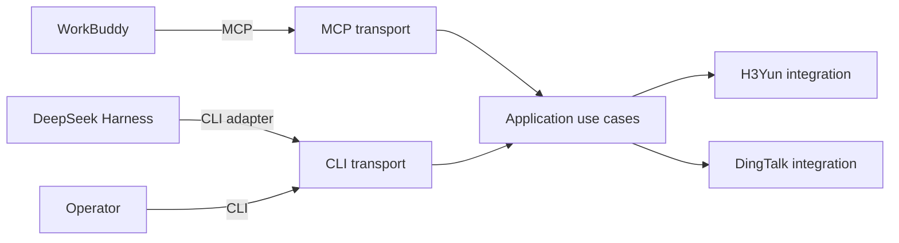

<h1 align="center">CRWU Agent Harness</h1>

<p align="center">
  Unifies AI CLI tools, MCP servers, Python Skills, and workflow orchestration in one codebase.
</p>

<p align="center">
  <a href="https://github.com/mmungdong/crwu-ai/releases">
    
  </a>
  <a href="https://go.dev/doc/devel/release">
    
  </a>
  <a href="./Makefile">
    
  </a>
  <a href="./README.zh-CN.md">
    
  </a>
</p>

<p align="center">
  
  
  
  
</p>

---

## Overview

**CRWU Agent Harness** is a Go-based command-line toolkit that connects AI hosts
to enterprise systems through a stable command catalog. The repository is
organized so that protocol transports, application use cases, external-system
integrations, and Python Skills remain clearly separated.

> **Current status:** the CLI command catalog and the first DingTalk employee
> login vertical slice are executable. H3Yun identity mapping, H3Yun business
> operations, MCP tools, and Python Skills remain planned.

## Components

| Component | Scope | Status |
|-----------|-------|--------|
| **AI CLI** | Human and AI-driven command entry point (`crwu`) |  |
| **Auth Server** | Server-side DingTalk OAuth callback and CRWU session issuance (`crwu-server`) |  |
| **MCP Server** | Future Model Context Protocol transport boundary |  |
| **Python Skills** | Independently packaged agent skills |  |
| **Workflow Engine** | Future orchestration layer for cross-provider flows |  |

## Table of Contents

- [Overview](#overview)
- [Components](#components)
- [Requirements](#requirements)
- [Quick Start](#quick-start)
- [DingTalk Login](#dingtalk-login)
- [Commands](#commands)
- [AI Command Discovery](#ai-command-discovery)
- [Architecture](#architecture)
- [Directory Map](#directory-map)
- [Development](#development)
- [Documentation](#documentation)

## Requirements

| Dependency | Version | Notes |
|------------|---------|-------|
| Go         | 1.24+   | Required to build `crwu` |
| GNU Make   | any     | Used for build tasks |

## Quick Start

Build both binaries, print the CLI version, and run the tests:

```bash
make build
./bin/crwu version
make test
```

If Go is not on `PATH`, pass its location to Make:

```bash
make GO=/path/to/go build
```

Generated binaries are written only to `bin/`. Run `make clean` to remove that
directory.

## DingTalk Login

`crwu h3yun login` is the first end-to-end authentication slice. Employees
authorize once with DingTalk. The server verifies the configured organization,
resolves the employee's organization `userId` from `unionId`, issues an opaque
CRWU session, and returns the explicit identity to the CLI.

The DingTalk Client Secret and provider tokens remain on `crwu-server`. The CLI
stores only the opaque CRWU session in macOS Keychain, Windows Credential
Manager, or the Linux Secret Service.

Configure a DingTalk internal application with this exact callback URL:

```text
https://crwu.example.com/oauth/dingtalk/callback
```

The application needs the DingTalk APIs for obtaining the current user's
personal information and resolving a `userId` by `unionId`. Start the server
with secrets supplied by its runtime environment:

```bash
export CRWU_PUBLIC_URL=https://crwu.example.com
export CRWU_DINGTALK_CLIENT_ID=your-client-id
export CRWU_DINGTALK_CLIENT_SECRET=your-client-secret
export CRWU_DINGTALK_CORP_ID=your-corp-id
export CRWU_SERVER_ADDR=127.0.0.1:8080
./bin/crwu-server
```

Run the employee login from macOS or Windows:

```bash
CRWU_SERVER_URL=https://crwu.example.com ./bin/crwu h3yun login --json
```

For a browserless environment, add `--no-browser` and open the printed URL on
the employee's device. Remote server URLs must use HTTPS; HTTP is accepted only
for loopback development.

This first slice deliberately reports `"h3yunIdentity": "not_mapped"`. It
proves DingTalk identity and local secure session storage, but it does not yet
authorize an H3Yun operation. The next slice must map the explicit DingTalk
employee to exactly one H3Yun user and fail closed when no mapping exists.

Server sessions are currently in memory and are invalidated when
`crwu-server` restarts. This is suitable for the first login test, not yet for a
production rollout.

## Commands

| Command | Usage | Description |
|---------|-------|-------------|
| `help` | `crwu help` | Show available commands and usage information. |
| `h3yun login` | `crwu h3yun login [--server <url>] [--no-browser] [--timeout <duration>] [--json]` | Authenticate the current employee with DingTalk and store the CRWU session in the operating system credential store. |
| `h3yun ping` | `crwu h3yun ping` | Verify the H3Yun personal access token against the H3Yun agent gateway. |
| `h3yun tools` | `crwu h3yun tools` | List the H3Yun agent gateway tools visible to the current employee. |
| `h3yun session bind` | `crwu h3yun session bind --token <jwt>` | Bind the H3Yun web session token of the current employee to this machine. |
| `h3yun session status` | `crwu h3yun session status` | Show the bound H3Yun session identity and its expiry. |
| `h3yun session refresh` | `crwu h3yun session refresh` | Refresh the bound H3Yun web session token. |
| `h3yun session clear` | `crwu h3yun session clear` | Remove the bound H3Yun web session from this machine. |
| `h3yun apps list` | `crwu h3yun apps list [--keyword <name>]` | List H3Yun applications the current employee can access via the web session. |
| `h3yun apps children` | `crwu h3yun apps children --app <code>` | List the form function nodes inside one H3Yun application. |
| `h3yun forms search` | `crwu h3yun forms search --keyword <name>` | Search H3Yun forms by name keyword via the web session. |
| `h3yun records list` | `crwu h3yun records list --schema <code> [--page <n>] [--size <n>] [--keyword <kw>]` | List H3Yun business records of a form via the web session. |
| `h3yun records get` | `crwu h3yun records get --schema <code> --id <objectId>` | Load one H3Yun business record including its attachment fields. |
| `h3yun files list` | `crwu h3yun files list --schema <code> --id <objectId>` | List the attachment files of one H3Yun business record. |
| `h3yun file download` | `crwu h3yun file download --schema <code> --id <objectId> --out <dir>` | Download every attachment of one H3Yun business record to a directory. |
| `h3yun apps search` | `crwu h3yun apps search --keyword <name> [--page <n>] [--size <n>]` | Search H3Yun applications the current employee can access. |
| `h3yun records query` | `crwu h3yun records query --schema <code> --sql <select>` | Query H3Yun business records of a form with a read-only SELECT statement. |
| `scheme` | `crwu scheme` | Print the machine-readable command catalog for AI clients. |
| `version` | `crwu version` | Show the CLI version and build commit. |

Additional MCP and provider-specific commands will be introduced with their
first working use cases. The CLI does not advertise commands that are not
implemented.

## AI Command Discovery

`crwu scheme` is the canonical machine-readable command catalog. Its JSON output
contains the current CLI version and every supported subcommand. Each command
has an English description, exact usage, and at least one example with its own
English description.

```bash
crwu scheme
```

The command writes only JSON to standard output so an AI client can parse it
without stripping human-oriented log lines. Diagnostics are written to standard
error with a non-zero exit status.

See [`docs/cli-command-contract.md`](docs/cli-command-contract.md) before adding
or changing a command.

## Architecture



Design principles:

- Transports own protocol schemas, command parsing, and presentation.
- Application services coordinate host-neutral use cases.
- Integrations own provider clients, provider authentication details, DTOs, and
  provider error translation.
- H3Yun and DingTalk integrations are siblings. Neither imports the other.
- Python Skills are packaged independently and are not linked into the Go
  binary.

Employee authentication has exactly one provider: DingTalk. WorkBuddy and
DeepSeek Harness are outer callers and must not change the core login protocol
or application service.

## Directory Map

| Path | Purpose |
|------|---------|
| `cmd/crwu/` | Process entry point |
| `cmd/crwu-server/` | DingTalk callback and CRWU session server entry point |
| `internal/buildinfo/` | Linker-injected build metadata |
| `internal/transport/cli/` | CLI command behavior |
| `internal/transport/mcp/` | Future MCP protocol boundary |
| `internal/app/h3yunlogin/` | Host-neutral DingTalk login orchestration |
| `internal/app/h3yunops/` | H3Yun application service (token source, gateway operations) |
| `internal/app/h3yunweb/` | H3Yun web-session application service (bind, refresh, reads) |
| `internal/platform/h3yuncreds/` | Local OS-credential-store persistence for H3Yun sessions |
| `internal/integrations/dingtalk/` | DingTalk OAuth and employee identity API client |
| `internal/integrations/h3yun/` | H3Yun agent gateway MCP client |
| `internal/integrations/crwuserver/` | CLI-side CRWU authentication API client |
| `internal/auth/` | Principal, session, and OS credential-store policy |
| `internal/config/` | Typed server configuration loading and validation |
| `internal/transport/httpapi/` | CRWU authentication HTTP endpoints |
| `internal/observability/` | Future logs, metrics, and tracing |
| `skills/` | Independently packaged Python Skills |
| `configs/workbuddy/` | WorkBuddy configuration examples |
| `deployments/` | Deployment assets when introduced |
| `tests/` | Cross-package contract and integration tests |
| `docs/` | Architecture and implementation records |

## Development

Format, build, and test in one flow:

```bash
make fmt
make build
make test
```

Keep the default application version synchronized between
`internal/buildinfo` and the root `Makefile`.

## Documentation

- [`docs/cli-command-contract.md`](docs/cli-command-contract.md) — rules every
  `crwu` subcommand must follow.
- [`AGENTS.md`](AGENTS.md) — agent-facing development guidelines.
- [`CONTEXT.md`](CONTEXT.md) — domain glossary for the project.
- [`README.zh-CN.md`](README.zh-CN.md) — synchronized Chinese documentation.

---

<p align="center">
  <a href="./README.zh-CN.md">简体中文</a>
</p>
