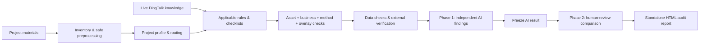
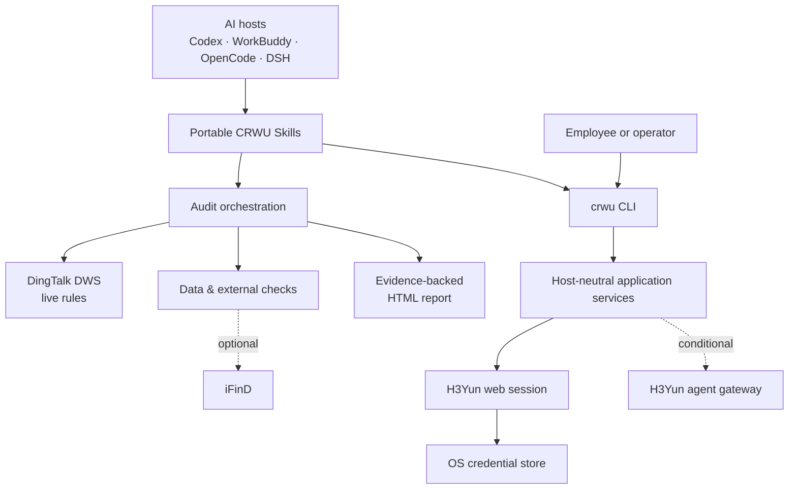

<div align="center">

# CRWU AI Toolkit

**Enterprise AI audit, knowledge access, and employee-scoped data tools — in one repository.**

Turn appraisal materials, enterprise knowledge, and business records into evidence-backed AI workflows without giving an agent more authority than the employee using it.

[简体中文](README.zh-CN.md) · [Explore Skills](skills/README.md) · [CLI Manual](docs/cli-manual.md) · [Change Log](docs/CHANGELOG.md)

<br>


**CLI-first · Skills-native · Evidence-driven · Human-reviewed**

</div>

---

## Why CRWU

CRWU started as a secure command surface for H3Yun and has grown into a practical AI toolkit for enterprise work. It now combines:

| | Capability | What it delivers |
| --- | --- | --- |
| 🧭 | **AI appraisal audit** | Routes each project across asset, business, method, regulatory, data, and public-standard checks, then produces one traceable HTML report. |
| 🔐 | **Employee-scoped enterprise access** | Lets an employee sign in to H3Yun with DingTalk and gives the AI only the apps, forms, records, and files that employee can access. |
| 📚 | **Live knowledge grounding** | Resolves the required rules from DingTalk knowledge spaces and downloads the current text for each audit instead of relying on stale copied guidance. |
| 🧩 | **Portable AI Skills** | Ships self-contained Skills for Codex, WorkBuddy, OpenCode, DeepSeek Harness, and other compatible agent hosts. |

The project is designed around a simple rule: **an AI conclusion must not exceed its evidence, permissions, or verified calculation boundary**.

## Capabilities

| Area | Current status | Notes |
| --- | --- | --- |
| Appraisal audit orchestration | **Available** | Two-phase independent audit and human-review comparison, with a standalone HTML deliverable. |
| Asset and business coverage | **Available** | 12 asset families, 8 business families, public standards, data checks, and optional external verification. |
| H3Yun web-session reads | **Available** | Employee QR login, apps, forms, records, filters, and attachment downloads. |
| DingTalk knowledge access | **Available with DWS** | Directory metadata may be cached; rule text is downloaded live for each audit. |
| iFinD external verification | **Conditional** | Enabled only when a supported iFinD connector or Skill is available in the AI host. |
| H3Yun agent gateway | **Conditional** | Commands are implemented; availability depends on the employee token and H3Yun data-plane enablement. |
| Standalone CRWU MCP transport | **Architecture boundary** | The repository preserves the transport boundary, while the shipped operator interface remains CLI + Skills. |

## Choose your path

| I want to… | Start here |
| --- | --- |
| Audit an appraisal project | [`crwu-audit`](skills/crwu-audit/SKILL.md) → [audit design](docs/design-crwu-audit-skills.md) |
| Review all available AI Skills | [Skills catalog](skills/README.md) |
| Sign in to H3Yun as an employee | [`crwu-h3yun-login`](skills/crwu-h3yun-login/SKILL.md) → [CLI manual](docs/cli-manual.md) |
| Query forms, records, and attachments | [`crwu-h3yun-query`](skills/crwu-h3yun-query/SKILL.md) |
| Ground an audit in DingTalk knowledge | [`crwu-dws`](skills/crwu-dws/SKILL.md) → [live-knowledge protocol](docs/design-audit-live-kb-protocol.md) |
| Install or update Skills for an AI host | [`crwu-init`](skills/crwu-init/SKILL.md) |
| Maintain or extend the audit system | [`AGENTS.md`](AGENTS.md) → [`skills/AGENTS.md`](skills/AGENTS.md) |

## Quick start

### 1. Build the CLI

Prerequisites: **Go 1.24+** and **GNU Make**.

```bash
git clone https://github.com/mmungdong/crwu-ai.git
cd crwu-ai
make build

./bin/darwin/crwu version
make test
```

`make build` produces macOS and Windows binaries under `bin/darwin/` and `bin/windows/`. Use `make build-mac` or `make build-win` when only one target is needed.

### 2. Bind an employee H3Yun session

```bash
./bin/darwin/crwu h3yun session login
./bin/darwin/crwu h3yun session status
./bin/darwin/crwu h3yun apps list
```

The login command opens the browser for a DingTalk QR scan. The resulting session is stored in the local OS credential store and is not printed into the terminal or AI conversation.

### 3. Install the Skills you need

Every directory under `skills/` that contains a `SKILL.md` is independently installable. The recommended entry point is [`crwu-init`](skills/crwu-init/SKILL.md), which can install all Skills, selected Skills, or update already-installed Skills for the chosen agent host.

To bootstrap it for Codex from a local clone:

```bash
mkdir -p ~/.codex/skills
cp -R skills/crwu-init ~/.codex/skills/crwu-init
```

Then ask the agent:

> Initialize all CRWU Skills for Codex.

For WorkBuddy, OpenCode, DeepSeek Harness, or a custom host, let `crwu-init` resolve and confirm the target Skills directory before it writes anything.

## AI appraisal audit

`crwu-audit` is the orchestration layer for the appraisal-audit family. It profiles the project first, loads only the applicable rule and domain Skills, preserves evidence boundaries, and produces a reviewable result rather than a black-box score.



### Audit model

- **Profile before checking:** report type, transaction or business context, assets, methods, and regulatory overlays determine the execution set.
- **Union, not a single label:** applicable asset, business, method, overlay, public-standard, and data-check axes are combined.
- **Live rules:** rule text is retrieved from the knowledge source for the current engagement; Skills carry routing contracts, not copied rule bodies.
- **Two-phase isolation:** the AI audit is completed and frozen before human review files are read and compared.
- **Evidence over confidence:** unreadable, hidden, unsupported, or unrecalculated content is reported as unchecked — never silently converted into “missing” or “verified.”
- **Human decision remains final:** the output supports professional review; it does not replace it.

### Report experience

The current standalone report is designed for task-first reading:

1. AI audit summary and scope;
2. AI-detected issues, including a visible **AI-only finding** marker and severity distribution after comparison;
3. external-data verification;
4. ordered human-review files and item-by-item AI comparison;
5. objective percentage-based hit rates with resolved items excluded from the denominator;
6. manual confirmations, evidence, and traceability.

Issue locations and descriptions remain visible. Long modification suggestions and rule/evidence detail use clearly labelled disclosure controls, while print output expands the necessary content automatically. Items marked “fixed” in a review file can still be flagged when the audited material shows that the issue remains unresolved.

## Skills ecosystem

The repository currently contains **30 independently installable Skills**.

| Group | Count | Responsibility |
| --- | ---: | --- |
| Audit orchestration | 1 | Project profiling, routing, two-phase execution, and report delivery. |
| Asset audit Skills | 12 | Real estate, equipment, enterprise value, intangible assets, mining rights, inventory, debt, portfolios, transport equipment, goodwill asset groups, scrap materials, and other assets. |
| Business audit Skills | 8 | Asset operation, transactions, financial reporting, financing, investment, tax/history, judicial matters, and consulting/review. |
| Data and external checks | 2 | Spreadsheet/data consistency and conditional public-data verification. |
| Enterprise access and knowledge | 3 | H3Yun login, H3Yun query, and DingTalk DWS knowledge access. |
| Standards, distribution, and maintenance | 4 | Public standards, initialization, audit optimization, and Skill maintenance. |

Skills are self-contained by contract: an installed Skill must not rely on repository-relative files outside its own directory. See the [complete Skills catalog](skills/README.md) for triggers, responsibilities, and dependency boundaries.

## CLI and H3Yun access

The Go CLI is the stable command surface used by operators and AI clients. `crwu scheme` emits the canonical command catalog as clean JSON, including descriptions, usage, and examples.

### Employee workflow

```bash
# Sign in and inspect identity
crwu h3yun session login
crwu h3yun session status

# Discover accessible data
crwu h3yun apps list
crwu h3yun apps children --app <appCode>
crwu h3yun forms search --keyword <name>

# Read records and download their files
crwu h3yun records list --schema <schemaCode> --filter "Status = 1"
crwu h3yun records get --schema <schemaCode> --id <recordId>
crwu h3yun file download --schema <schemaCode> --id <recordId> --out ./files
```

<details>
<summary><strong>Show the complete CLI command catalog</strong></summary>

#### Core

| Command | Purpose |
| --- | --- |
| `crwu scheme [command-path]` | Print the machine-readable command catalog for AI clients. |
| `crwu version` | Show the CLI version, commit, build time, and platform. |

#### H3Yun session

| Command | Purpose |
| --- | --- |
| `crwu h3yun session login` | Open a browser, scan with DingTalk, and bind the employee session locally. |
| `crwu h3yun session bind --token <jwt>` | Bind a trusted employee web-session token as a fallback. |
| `crwu h3yun session status` | Show the bound identity, engine, and expiry. |
| `crwu h3yun session refresh` | Renew the bound session token. |
| `crwu h3yun session clear` | Remove the bound session from this machine. |

#### Apps, forms, and records

| Command | Purpose |
| --- | --- |
| `crwu h3yun apps list [--keyword <name>]` | List applications available to the employee. |
| `crwu h3yun apps children --app <code>` | List form nodes inside an application. |
| `crwu h3yun apps search --keyword <name>` | Search applications through the agent channel. |
| `crwu h3yun forms search --keyword <name>` | Search forms through the employee web session. |
| `crwu h3yun records list --schema <code> [--keyword <kw>] [--filter <expr>]` | Page through records with optional search and field conditions. |
| `crwu h3yun records get --schema <code> --id <id>` | Read one record with its fields. |
| `crwu h3yun records query --schema <code> --sql <select>` | Execute a read-only SELECT through the agent channel. |

#### Files and agent gateway

| Command | Purpose |
| --- | --- |
| `crwu h3yun files list --schema <code> --id <id>` | List a record's attachment files. |
| `crwu h3yun file download --schema <code> --id <id> --out <dir>` | Download every attachment from a record. |
| `crwu h3yun file get --id <fileId> --out <file>` | Download one attachment by file ID. |
| `crwu h3yun ping` | Handshake with the H3Yun agent gateway. |
| `crwu h3yun tools` | List gateway tools visible to the current token. |

</details>

For flags, output contracts, filters, and examples, use the [CLI manual](docs/cli-manual.md). When changing a command, follow the [CLI command contract](docs/cli-command-contract.md) and keep `crwu scheme` authoritative.

## Architecture



- **Skills** describe workflows, routing, evidence rules, and host-side tool use.
- **CLI transports** own parsing and presentation; application services remain independent of the AI host.
- **Provider integrations** encapsulate H3Yun protocols and do not import one another.
- **Audit knowledge** is resolved by path and rule ID, then downloaded for the current engagement.
- **Deliverables** are self-contained artifacts that remain readable without the execution environment.

## Security and trust boundaries

| Boundary | Project rule |
| --- | --- |
| Employee identity | Every H3Yun credential belongs to one explicit employee; the system never falls back to an administrator or engine-wide identity. |
| Credential handling | H3Yun sessions are stored in the OS credential store, never in repository files, logs, `scheme` output, or chat. |
| Authorization | A credential must be validated before an employee-scoped operation is allowed. |
| Data mutation | H3Yun query workflows and DingTalk knowledge access are designed for read-only use. |
| Hidden spreadsheet regions | Default audit mode excludes manually hidden sheets, rows, and columns; deeper inspection requires an explicit boundary change. |
| Unsupported evidence | “Unchecked” is not rewritten as “missing,” and unrecalculated values are not presented as verified. |
| External sources | External verification runs only through explicitly supported sources and reports when the connector is unavailable. |

> [!IMPORTANT]
> CRWU helps reviewers find, organize, and compare evidence. Professional conclusions and final approval remain the responsibility of qualified human reviewers.

## Repository map

```text
crwu-ai/
├── cmd/crwu/                     # CLI entry point
├── internal/
│   ├── app/                      # host-neutral application services
│   ├── integrations/h3yun/       # H3Yun web and agent-gateway clients
│   ├── platform/                 # credential storage and scan login
│   └── transport/                # CLI and MCP protocol boundaries
├── skills/                       # 30 self-contained AI Skills
│   ├── crwu-audit/               # audit router, contracts, scripts, template
│   ├── crwu-audit-asset-*/       # 12 asset audit families
│   ├── crwu-audit-biz-*/         # 8 business audit families
│   ├── crwu-dws/                 # live DingTalk knowledge access
│   └── crwu-h3yun-*/             # employee login and query workflows
├── docs/                         # manuals, contracts, designs, and changelog
├── scripts/html/                 # standalone HTML utilities/examples
└── tests/                        # cross-package verification
```

## Development

```bash
make fmt
make test
make build

# Validate every Skill and its self-containment contract
python3 skills/crwu-audit-skill-maintainer/scripts/kb_tool.py \
  validate --skill-root skills
```

When contributing:

1. keep CLI behavior and AI-host adapters separated;
2. register every invokable command in `crwu scheme`;
3. keep each Skill independently installable;
4. update `docs/cli-manual.md` and `docs/CHANGELOG.md` for functional CLI changes;
5. synchronize this README with [`README.zh-CN.md`](README.zh-CN.md).

The default CLI version must remain synchronized between `internal/buildinfo` and the root `Makefile`.

## Documentation

| Document | Use it for |
| --- | --- |
| [CLI manual](docs/cli-manual.md) | Commands, flags, environment variables, filters, and operator workflows. |
| [Skills catalog](skills/README.md) | Complete Skill inventory, audit axes, triggers, and responsibilities. |
| [Audit Skills design](docs/design-crwu-audit-skills.md) | Domain model, capability tree, and routing architecture. |
| [Live-knowledge protocol](docs/design-audit-live-kb-protocol.md) | How audits resolve and retrieve current knowledge without copying rule bodies. |
| [DWS design](docs/design-crwu-dws.md) | DingTalk directory cache and live-content retrieval model. |
| [CLI command contract](docs/cli-command-contract.md) | Requirements for descriptions, usage, examples, and machine-readable discovery. |
| [Change log](docs/CHANGELOG.md) | Recent behavior, audit-system, and delivery-template changes. |
| [Agent guidelines](AGENTS.md) | Repository-wide development and security constraints. |
| [Domain context](CONTEXT.md) | Shared terminology and system boundaries. |

---

<div align="center">

**Build AI workflows that remain useful when the evidence is incomplete — because they say exactly what was checked.**

[简体中文](README.zh-CN.md) · [Skills](skills/README.md) · [CLI Manual](docs/cli-manual.md)

</div>
