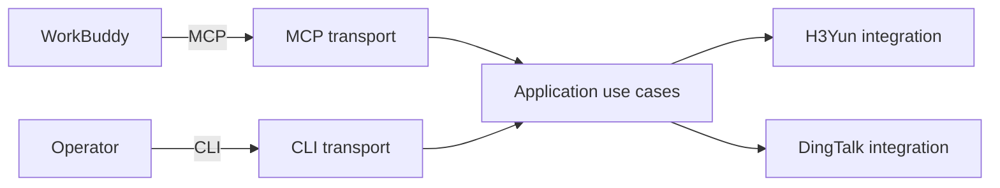

<h1 align="center">CRWU Agent Harness</h1>

<p align="center">
  Unifies AI CLI tools, MCP servers, Python Skills, and workflow orchestration in one codebase.
</p>

<p align="center">
  <a href="https://github.com/mmungdong/crwu-ai/releases">
    
  </a>
  <a href="https://go.dev/doc/devel/release">
    
  </a>
  <a href="./Makefile">
    
  </a>
  <a href="./README.zh-CN.md">
    
  </a>
</p>

<p align="center">
  
  
  
  
</p>

---

## Overview

**CRWU Agent Harness** is a Go-based command-line toolkit that connects WorkBuddy
to enterprise systems through a stable command catalog. The repository is
organized so that protocol transports, application use cases, external-system
integrations, and Python Skills remain clearly separated.

> **Current status:** executable project skeleton. MCP tools, H3Yun/DingTalk
> APIs, authentication, and Python Skills are planned and will be introduced
> with their first working use cases.

## Components

| Component | Scope | Status |
|-----------|-------|--------|
| **AI CLI** | Human and AI-driven command entry point (`crwu`) |  |
| **MCP Server** | Future Model Context Protocol transport boundary |  |
| **Python Skills** | Independently packaged agent skills |  |
| **Workflow Engine** | Future orchestration layer for cross-provider flows |  |

## Table of Contents

- [Overview](#overview)
- [Components](#components)
- [Requirements](#requirements)
- [Quick Start](#quick-start)
- [Commands](#commands)
- [AI Command Discovery](#ai-command-discovery)
- [Architecture](#architecture)
- [Directory Map](#directory-map)
- [Development](#development)
- [Documentation](#documentation)

## Requirements

| Dependency | Version | Notes |
|------------|---------|-------|
| Go         | 1.24+   | Required to build `crwu` |
| GNU Make   | any     | Used for build tasks |

## Quick Start

Build the binary, print its version, and run the tests:

```bash
make build
./bin/crwu version
make test
```

If Go is not on `PATH`, pass its location to Make:

```bash
make GO=/path/to/go build
```

Generated binaries are written only to `bin/`. Run `make clean` to remove that
directory.

## Commands

| Command | Usage | Description |
|---------|-------|-------------|
| `help` | `crwu help` | Show available commands and usage information. |
| `scheme` | `crwu scheme` | Print the machine-readable command catalog for AI clients. |
| `version` | `crwu version` | Show the CLI version and build commit. |

MCP and provider-specific commands will be introduced with their first working
use cases. The skeleton does not advertise commands that are not implemented.

## AI Command Discovery

`crwu scheme` is the canonical machine-readable command catalog. Its JSON output
contains the current CLI version and every supported subcommand. Each command
has an English description, exact usage, and at least one example with its own
English description.

```bash
crwu scheme
```

The command writes only JSON to standard output so an AI client can parse it
without stripping human-oriented log lines. Diagnostics are written to standard
error with a non-zero exit status.

See [`docs/cli-command-contract.md`](docs/cli-command-contract.md) before adding
or changing a command.

## Architecture



Design principles:

- Transports own protocol schemas, command parsing, and presentation.
- Application services coordinate host-neutral use cases.
- Integrations own provider clients, provider authentication details, DTOs, and
  provider error translation.
- H3Yun and DingTalk integrations are siblings. Neither imports the other.
- Python Skills are packaged independently and are not linked into the Go
  binary.

Only WorkBuddy is currently supported and documented as an AI host. Protocol
code avoids WorkBuddy-private coupling, but compatibility with other hosts is
not claimed or maintained.

## Directory Map

| Path | Purpose |
|------|---------|
| `cmd/crwu/` | Process entry point |
| `internal/buildinfo/` | Linker-injected build metadata |
| `internal/transport/cli/` | CLI command behavior |
| `internal/transport/mcp/` | Future MCP protocol boundary |
| `internal/app/` | Future shared application use cases |
| `internal/integrations/` | Future H3Yun and DingTalk adapters |
| `internal/auth/` | Future cross-cutting identity policy |
| `internal/config/` | Future typed configuration loading |
| `internal/observability/` | Future logs, metrics, and tracing |
| `skills/` | Independently packaged Python Skills |
| `configs/workbuddy/` | WorkBuddy configuration examples |
| `deployments/` | Deployment assets when introduced |
| `tests/` | Cross-package contract and integration tests |
| `docs/` | Architecture and implementation records |

## Development

Format, build, and test in one flow:

```bash
make fmt
make build
make test
```

Keep the default application version synchronized between
`internal/buildinfo` and the root `Makefile`.

## Documentation

- [`docs/cli-command-contract.md`](docs/cli-command-contract.md) — rules every
  `crwu` subcommand must follow.
- [`AGENTS.md`](AGENTS.md) — agent-facing development guidelines.
- [`CONTEXT.md`](CONTEXT.md) — domain glossary for the project.
- [`README.zh-CN.md`](README.zh-CN.md) — synchronized Chinese documentation.

---

<p align="center">
  <a href="./README.zh-CN.md">简体中文</a>
</p>
