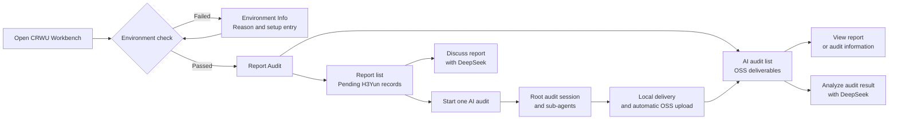
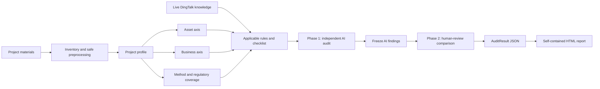
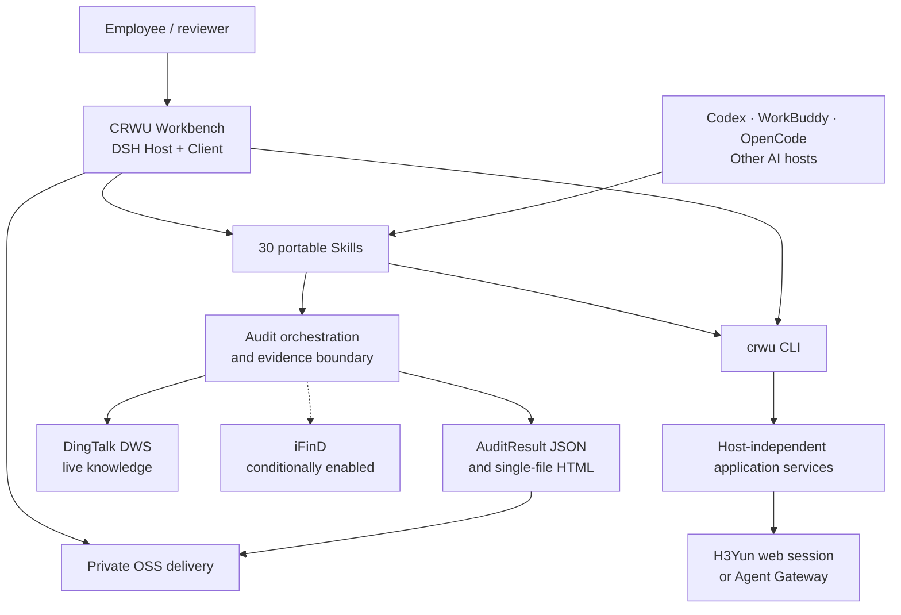

<div align="center">

# CRWU AI

**Enterprise AI audit platform for appraisal work**

From employee-scoped data and live professional knowledge to two-phase review and traceable delivery, CRWU connects the full workflow inside one trusted boundary.

[简体中文](README.zh-CN.md) · [Skills Catalog](docs/skills.md) · [CLI Manual](docs/v0.0.1/cli-manual.md) · [Workbench Guide](plugins/dsh-crwu-workbench/README.md) · [Changelog](docs/v0.0.1/CHANGELOG.md)

<br>


**Employee-scoped · Live knowledge · Evidence-driven · Human-reviewed**

</div>

---

## CRWU at a glance

CRWU is not a chatbot that simply returns conclusions. It is a system made of three connected products:

| Product layer | Purpose | Current delivery |
| --- | --- | --- |
| **CRWU Workbench** | Environment checks, report audits, audit tracking, result inspection, and analysis sessions inside DeepSeek Harness | DSH package plugin: `dsh-crwu-workbench` |
| **Appraisal audit Skills** | Project profiling, multi-axis routing, specialist checks, two-phase isolation, and report delivery | 30 independently installable AI Skills |
| **CRWU CLI** | Employee-scoped access to H3Yun apps, forms, records, and attachments, exposed through a stable command catalog for AI clients | Go binary: `crwu` |

One principle governs the entire system:

> **An AI conclusion must not exceed the evidence it obtained, the employee permissions it inherited, or the calculation boundary it actually verified.**

## Capability status

| Capability | Status | Notes |
| --- | --- | --- |
| DSH CRWU Workbench | **Available** | Three-module sidebar, hard environment gate, report audit, audit history, OSS deliverables, and DeepSeek analysis sessions. |
| Two-phase appraisal audit | **Available** | Phase 1 freezes the AI's independent findings; Phase 2 then reads human-review comments for comparison. |
| Asset and business coverage | **Available** | 12 asset families, 8 business families, public standards, data checks, and conditional external verification. |
| Employee-scoped H3Yun reads | **Available** | DingTalk QR sign-in with access to apps, forms, records, filters, and attachments. |
| Live DingTalk knowledge | **Available after DWS setup** | Directory metadata may be cached; the applicable rule text is fetched again for every audit. |
| Aliyun OSS delivery | **Available after setup** | Private bucket, employee-side credentials, automatic upload, and time-limited signed URLs. |
| iFinD external verification | **Conditional** | Enabled only when the host provides a supported iFinD connector or Skill. |
| Report evaluation module | **In development** | The Workbench entry is reserved; Report Audit is the production-ready module today. |
| Standalone MCP service | **Reserved boundary** | The code preserves a transport boundary; Workbench, CLI, and Skills remain the supported entry points. |

## Start with your task

| I want to… | Recommended entry |
| --- | --- |
| Install the complete Workbench in DSH | [Workbench installation and usage](plugins/dsh-crwu-workbench/README.md) |
| Audit an appraisal report | [`crwu-audit`](plugins/dsh-crwu-workbench/skills/crwu/crwu-audit/SKILL.md) |
| Explore every audit capability | [Skills catalog](docs/skills.md) |
| Sign in to H3Yun and query business data | [`crwu-h3yun-login`](plugins/common/skills/crwu-h3yun-login/SKILL.md) → [CLI manual](docs/v0.0.1/cli-manual.md) |
| Use live rules from DingTalk knowledge spaces | [`crwu-dws`](plugins/common/skills/crwu-dws/SKILL.md) |
| Install Skills for Codex or another host | [AI host directory guide](docs/agent-skill-dirs.md) |
| Extend or maintain the audit system | [`AGENTS.md`](AGENTS.md) → [`plugins/AGENTS.md`](plugins/AGENTS.md) |

## CRWU Workbench

The Workbench opens from a persistent sidebar group card. It follows the DSH theme, exposes three fixed modules when expanded, and keeps a compact branded entry when collapsed.

| Module | Current experience |
| --- | --- |
| **Report Evaluation** | A deliberately restrained in-development page that directs users to Report Audit for production work. |
| **Report Audit** | Pending reports, AI audit history, start/stop/rerun actions, deliverable viewing, audit-information drawer, and DeepSeek sessions. |
| **Environment Info** | Four prerequisite layers—tools, authentication, upload configuration, and external data—with audit creation blocked until required checks pass. |

### Workbench flow


```mermaid
flowchart LR
    A[Open CRWU Workbench] --> B{Environment check}
    B -->|Failed| C[Environment Info<br/>Reason and setup entry]
    C --> B
    B -->|Passed| D[Report Audit]
    D --> E[Report list<br/>Pending H3Yun records]
    D --> F[AI audit list<br/>OSS deliverables]
    E --> G[Start one AI audit]
    G --> H[Root audit session<br/>and sub-agents]
    H --> I[Local delivery<br/>and automatic OSS upload]
    I --> F
    E --> J[Discuss report<br/>with DeepSeek]
    F --> K[View report<br/>or audit information]
    F --> L[Analyze audit result<br/>with DeepSeek]
```

### Report-audit experience

- **One consistent workspace:** the report list and AI audit list share search, refresh, loading, pagination, and business-time conventions.
- **Single-audit concurrency:** only one audit runs at a time; stop, rerun, state recovery, and upload retry keep multiple agents from writing the same case concurrently.
- **Outcome-first hierarchy:** the audit-information drawer leads with review hit rate, AI findings, and issues raised but not corrected; technical fields remain collapsed by default.
- **Business-language deliverables:** employees see “Audit Report” and “Audit Data,” not raw OSS paths or internal object names.
- **Version-aware analysis sessions:** report files, audit artifacts, and review comments are compared using remote version evidence before a session is created; the user chooses explicitly when data may be stale.
- **Recognizable development and release modes:** sidebar and panel share `dev` or version labels; a Host/Client protocol mismatch blocks new audits and asks the user to restart.

### Remote-data boundary

The “Discuss Report” and “Analyze Audit Result” sessions receive only identifiers and context for materials fetched from remote business systems during the current run:

- report materials come from H3Yun attachments, while audit deliverables come from OSS;
- context records remote `fileId`, object key, ETag, update time, digest, and fetch time;
- local case paths are never treated as report identity, and a failed remote read never silently falls back to an old local copy;
- when remote evidence is incomplete, CRWU does not create the session—it reports the missing facts and allows a retry.

## Quick start

### 1. Build the CRWU CLI

Prerequisites: **Go 1.24+** and **GNU Make**.

```bash
git clone https://github.com/mmungdong/crwu-ai.git
cd crwu-ai

make build
./bin/darwin/crwu version
make test
```

`make build` produces:

```text
bin/darwin/crwu
bin/windows/crwu.exe
```

Use `make build-mac` or `make build-win` when you only need one target.

### 2. Sign in to H3Yun

The examples below assume `crwu` is on your `PATH`; otherwise replace it with the path to the binary you built.

```bash
crwu h3yun session login
crwu h3yun session status
crwu h3yun apps list
```

The login command opens a separate browser window for DingTalk QR sign-in. The session token is captured inside the process and stored in the operating system's credential store; it is not printed to the terminal or AI conversation.

### 3. Install the DSH Workbench

Plugin development requires **Node.js `^22.19.0` or `>=24.0.0`**.

```bash
make plugin-pack
dsh plugin --profile web add ./dist/dsh-crwu-workbench-<version>.tgz
```

The plugin package includes:

- Host and Client build entries;
- the plugin deployment YAML;
- 27 in-repo audit and maintenance Skills (`skills/crwu/` layer);
- 14 vendored DingTalk Skills from upstream `dingtalk-workspace-cli` (`skills/dws/` layer);
- 3 common enterprise-access Skills (`common/skills/` layer).

Maintainers can validate and distribute the plugin with `make plugin-dist`. If a remote tarball already exists with the same version but different contents, the command refuses to overwrite it; bump the version first.

### 4. Install Skills for another AI host

```bash
make skills-install AGENT_DIR=~/.codex/skills
```

The directory layout is the source of truth for the Skill catalog—there is no second manifest to keep in sync.
Skills are organized in **layers**, and DSH registers one skill root per layer (it scans exactly one level per root):

- `plugins/dsh-crwu-workbench/skills/crwu/`: the audit family and maintenance Skills (in-repo);
- `plugins/dsh-crwu-workbench/skills/dws/`: the DingTalk Skills vendored from `dingtalk-workspace-cli` (upstream Apache-2.0; rewritten only by `npm run dws:sync`, verified by `npm run dws:check`);
- `plugins/common/skills/`: the three shared H3Yun and DingTalk Skills;
- `plugins/dsh-crwu-workbench/common/skills/`: a generated synchronized copy used during packaging, not a source directory.

See [AI host directory conventions](docs/agent-skill-dirs.md) for supported host layouts.

## Appraisal audit model

`crwu-audit` is the top-level orchestrator for the audit family. It does not compress a project into one crude category; it builds a multi-axis project profile and merges every applicable capability into the execution set.


```mermaid
flowchart LR
    A[Project materials] --> B[Inventory and safe preprocessing]
    B --> C[Project profile]
    C --> D[Asset axis]
    C --> E[Business axis]
    C --> F[Method and regulatory coverage]
    K[Live DingTalk knowledge] --> G[Applicable rules and checklist]
    D --> G
    E --> G
    F --> G
    G --> H[Phase 1: independent AI audit]
    H --> I[Freeze AI findings]
    I --> J[Phase 2: human-review comparison]
    J --> L[AuditResult JSON]
    L --> M[Self-contained HTML report]
```

Every audit follows these constraints:

- **Multi-axis union:** asset, business, method, regulatory coverage, public standards, data checks, and external verification jointly determine the execution set.
- **Live knowledge retrieval:** Skills store routing and assembly contracts, not copied rule text that can become stale.
- **Two-phase isolation:** human-review files remain unreadable until the independent AI findings are frozen.
- **Visible-area boundary:** manually hidden sheets, rows, columns, and media are skipped by default; “not checked” must never be reported as “missing.”
- **Structured source of truth:** CRWU generates and validates AuditResult JSON first, then builds the employee-facing HTML and monitoring result from that same source.
- **Human accountability:** CRWU helps discover, organize, and compare evidence; it does not replace qualified professional judgment or final approval.

## Skills ecosystem

The repository contains **30 independently installable Skills**:

| Group | Count | Responsibility |
| --- | ---: | --- |
| Audit orchestrator | 1 | Project profiling, multi-axis assembly, two-phase execution, and delivery. |
| Asset audits | 12 | Real estate, machinery, enterprise value, intangible assets, mining rights, inventory, claims, asset portfolios, vehicles, goodwill-related asset groups, scrap materials, and other assets. |
| Business audits | 8 | Asset operation, transactions and disposal, financial reporting, financing and debt, investment and capital, tax history, judicial liquidation and compensation, and consulting review. |
| Data and external checks | 2 | Spreadsheet/data reconciliation and conditionally enabled iFinD verification. |
| Common rules and output | 2 | General standards and audit-opinion redaction rules. |
| Enterprise access | 3 | H3Yun login, H3Yun queries, and DingTalk DWS knowledge access. |
| Maintenance | 2 | Audit gap analysis and audit Skill maintenance. |

Each Skill must remain independently installable and runnable after leaving the source repository. It may not depend on repository paths outside its own directory. See the [Skills catalog](docs/skills.md) for the full list.

## CRWU CLI

The Go CLI is the stable command surface shared by operators and AI clients. `crwu scheme` emits machine-readable JSON whose descriptions, usage text, and examples stay synchronized with the real Cobra command tree.

```bash
# Discover commands
crwu scheme
crwu scheme h3yun records

# Sign in and confirm employee identity
crwu h3yun session login
crwu h3yun session status

# Find data visible to the employee
crwu h3yun apps list
crwu h3yun apps children --app <appCode>
crwu h3yun forms search --keyword <name>

# Read records and attachments
crwu h3yun records list --schema <schemaCode> --filter "Status = 1"
crwu h3yun records get --schema <schemaCode> --id <recordId>
crwu h3yun files list --schema <schemaCode> --id <recordId>
crwu h3yun file get --id <fileId> --out ./files/report.pdf
```

See the [CLI manual](docs/v0.0.1/cli-manual.md) for arguments, filter syntax, output shapes, and Agent Gateway commands.

## System architecture


```mermaid
flowchart TB
    USER[Employee / reviewer]
    DSH[CRWU Workbench<br/>DSH Host + Client]
    HOSTS[Codex · WorkBuddy · OpenCode<br/>Other AI hosts]
    SKILLS[30 portable Skills]
    AUDIT[Audit orchestration<br/>and evidence boundary]
    CLI[crwu CLI]
    APP[Host-independent application services]
    H3[H3Yun web session<br/>or Agent Gateway]
    DWS[DingTalk DWS<br/>live knowledge]
    OSS[Private OSS delivery]
    IFIND[iFinD<br/>conditionally enabled]
    REPORT[AuditResult JSON<br/>and single-file HTML]

    USER --> DSH
    DSH --> SKILLS
    HOSTS --> SKILLS
    SKILLS --> AUDIT
    SKILLS --> CLI
    DSH --> CLI
    DSH --> OSS
    AUDIT --> DWS
    AUDIT -.-> IFIND
    AUDIT --> REPORT
    CLI --> APP
    APP --> H3
    REPORT --> OSS
```

Boundary design:

- **Skills** describe business workflows, routing, evidence rules, and tool usage;
- **application services** do not depend on a specific AI host—the CLI is only a transport layer;
- **H3Yun web sessions and Agent Gateway** are independent provider integrations;
- the **DSH plugin Host** owns file, shell, OSS, sub-agent, and credential operations;
- the **DSH plugin Client** owns browser state and interaction, communicating with the Host through same-origin RPC.

## Security and trust boundaries

| Boundary | Project rule |
| --- | --- |
| Employee identity | Every H3Yun credential belongs to one explicit employee; there is no fallback to an administrator or engine-wide identity. |
| Credential storage | H3Yun sessions enter the operating system credential store; OSS credentials remain on the employee machine with restricted file permissions; secrets never enter the repository. |
| Least privilege | Queries execute within the employee's own visible scope; DSH commands that read local credentials require employee authorization first. |
| Data provenance | Business-analysis sessions use only remote materials explicitly fetched in the current run, never an unverified local copy used to fill gaps. |
| Two-phase isolation | Phase 1 cannot read human-review comments before its findings are frozen, preventing human conclusions from being presented as independent AI discoveries. |
| Hidden data | Manually hidden areas are unreadable and unreportable by default; any boundary change must be explicit. |
| Strength of conclusion | When data cannot be read, recalculated, or supported, CRWU reports “not checked”—never “missing” or “verified.” |
| Private delivery | Audit artifacts enter a private bucket and are accessed through time-limited signed URLs by default. |

> [!IMPORTANT]
> CRWU is a professional review-assistance system. It does not replace the final decisions of qualified appraisers, reviewers, or approvers.

## Repository layout

```text
crwu-ai/
├── cmd/
│   ├── crwu/                         # Production CLI entry
│   └── probe/                        # Protocol probing tool
├── internal/
│   ├── app/                          # Host-independent application services
│   ├── integrations/h3yun/           # H3Yun web and Agent Gateway clients
│   ├── platform/                     # QR login, browser discovery, credential store
│   └── transport/cli/                # Cobra CLI and scheme command catalog
├── plugins/
│   ├── common/skills/                # 3 common Skills (source)
│   └── dsh-crwu-workbench/
│       ├── src/host/                 # Host operations, configuration, state, services
│       ├── src/client/               # Sidebar, Workbench UI, browser state
│       ├── src/shared/               # Shared Host/Client protocol
│       ├── skills/crwu/              # 27 audit and maintenance Skills (in-repo layer)
│       ├── skills/dws/               # 14 vendored DingTalk Skills (upstream layer)
│       ├── config/                   # Single deployment YAML
│       ├── tests/                    # Node unit and integration tests
│       └── scripts/                  # Build, package, and release checks
├── scripts/                          # Repository-level plugin distribution tools
├── docs/                             # Manuals, designs, plans, and changelogs
├── .github/workflows/                # Go/plugin CI and npm publishing
└── Makefile                          # Unified CLI, plugin, and Skills entry points
```

## Development and verification

### Go CLI

```bash
make fmt
make test
make build
```

### Full DSH plugin gate

```bash
make plugin-check
```

This gate covers:

1. plugin version and YAML configuration consistency;
2. common-Skill synchronization;
3. strict TypeScript checking;
4. Node unit and integration tests;
5. Host and Client builds;
6. real build-artifact load smoke tests;
7. npm tarball contents and installation shape;
8. self-containment linting for both Skill roots;
9. audit routing, maintenance tooling, DWS data contracts, and distribution guards.

For plugin-only development:

```bash
cd plugins/dsh-crwu-workbench
npm ci
npm run check
npm run pack:assert
```

Development constraints are defined in [`AGENTS.md`](AGENTS.md), [`plugins/AGENTS.md`](plugins/AGENTS.md), and the plugin's own [`AGENTS.md`](plugins/dsh-crwu-workbench/AGENTS.md).

## Versions and distribution

The CLI and Workbench are released independently:

| Deliverable | Current source version | Distribution |
| --- | --- | --- |
| `crwu` CLI | `0.0.1` | `make build` produces macOS and Windows binaries |
| `dsh-crwu-workbench` | `0.0.4` | npm, TGZ, or static OSS distribution |
| AI Skills | Evolves with the repository | Included in the plugin package or installed with `make skills-install` |

The plugin version must match in `package.json`, `VERSION`, and the plugin `CHANGELOG.md`. A `plugin-v*` tag drives npm publishing; OSS distribution follows the rule “one version number, one publication.”

## Documentation map

| Document | What it covers |
| --- | --- |
| [Workbench plugin guide](plugins/dsh-crwu-workbench/README.md) | Installation, configuration, development loop, device acceptance, and release. |
| [Skills catalog](docs/skills.md) | Responsibilities, triggers, and dependency boundaries for all 44 Skills (27 in-repo + 14 vendored + 3 shared). |
| [CLI manual](docs/v0.0.1/cli-manual.md) | Commands, arguments, filter syntax, environment variables, and operating flows. |
| [Audit system design](docs/v0.0.1/design-crwu-audit-skills.md) | Project profiling, capability tree, multi-axis routing, and delivery model. |
| [Live-knowledge protocol](docs/v0.0.1/design-audit-live-kb-protocol.md) | How every audit locates and fetches current knowledge text. |
| [CLI command contract](docs/v0.0.1/cli-command-contract.md) | Requirements for `crwu scheme`, command descriptions, usage, and examples. |
| [Plugin UI design guidelines](plugins/dsh-crwu-workbench/docs/ui-design-guidelines.md) | Visual language, theme variables, layout, and interaction rules. |
| [Plugin development notes](plugins/dsh-crwu-workbench/docs/development-notes.md) | Cordis lifecycle, Host/Client boundary, build mechanics, and historical pitfalls. |
| [Changelog](docs/v0.0.1/CHANGELOG.md) | CLI, Skills, and audit-system history. |
| [Domain context](CONTEXT.md) | Shared terminology and system boundaries. |

---

<div align="center">

**Make AI explain what it checked, what evidence it used, and what still requires human judgment.**

[Back to top](#crwu-ai) · [简体中文](README.zh-CN.md) · [Get started](#quick-start)

</div>
