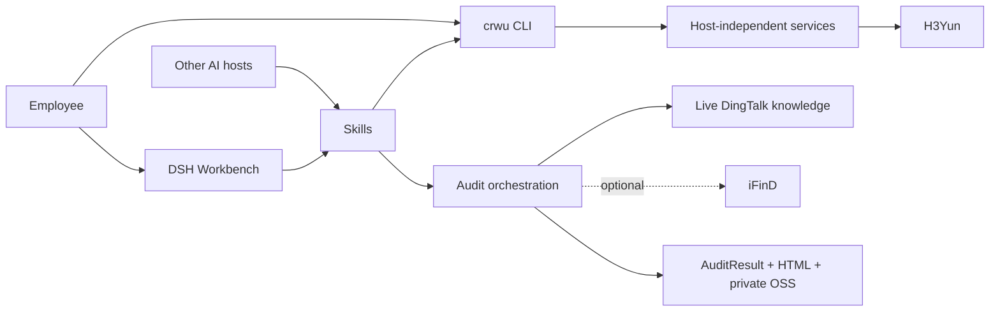

<div align="center">

# CRWU AI

**Enterprise AI audit tooling for appraisal work**

CRWU connects employee-scoped business data, live professional knowledge, evidence-aware audit workflows, and traceable delivery.

[简体中文](README.zh-CN.md) · [Workbench](plugins/dsh-crwu-workbench/README.md) · [Skills](docs/skills.md) · [CLI manual](docs/v0.0.1/cli-manual.md) · [Changelog](docs/v0.0.1/CHANGELOG.md)


**Employee-scoped · Live knowledge · Evidence-driven · Human-reviewed**

</div>

## What is in this repository

| Component | Responsibility | Entry point |
| --- | --- | --- |
| CRWU Workbench | DeepSeek Harness environment setup, report audits, audit history, deliverables, and analysis sessions | [`plugins/dsh-crwu-workbench/`](plugins/dsh-crwu-workbench/) |
| Appraisal audit Skills | Project profiling, multi-axis routing, specialist checks, evidence boundaries, and delivery | [`docs/skills.md`](docs/skills.md) |
| `crwu` CLI | Employee-scoped H3Yun applications, forms, records, attachments, and machine-readable command discovery | [`docs/v0.0.1/cli-manual.md`](docs/v0.0.1/cli-manual.md) |

CRWU assists professional review; qualified reviewers and approvers remain responsible for final decisions.

## Start with your task

| Goal | Use |
| --- | --- |
| Install or operate the DSH Workbench | [Workbench guide](plugins/dsh-crwu-workbench/README.md) |
| Audit an appraisal report | [`crwu-audit`](plugins/dsh-crwu-workbench/skills/crwu/crwu-audit/SKILL.md) |
| Understand or maintain Skill layers | [Skills guide](docs/skills.md) |
| Sign in to H3Yun or query employee-visible data | [CLI manual](docs/v0.0.1/cli-manual.md) |
| Use live DingTalk knowledge | [`crwu-dws`](plugins/common/skills/crwu-dws/SKILL.md) |
| Install Skills for another AI host | [AI host directory guide](docs/agent-skill-dirs.md) |
| Change repository or plugin behavior | [`AGENTS.md`](AGENTS.md), then the nearest nested `AGENTS.md` |

## Quick start

### Build the CLI

Requires Go and GNU Make.

```bash
git clone https://github.com/mmungdong/crwu-ai.git
cd crwu-ai
make build
make test
./bin/darwin/crwu version
```

Build one platform with `make build-mac` or `make build-win`. Use `crwu scheme` to discover the installed command contract.

### Sign in to H3Yun

```bash
crwu h3yun session login
crwu h3yun session status
```

The employee completes DingTalk QR sign-in in a browser. CRWU validates the resulting employee session and stores it in the operating-system credential store; it does not print the token or ask for an H3Yun password.

### Install the Workbench

Install the published package:

```bash
dsh plugin --profile web add dsh-crwu-workbench@latest
```

Maintainers can build and inspect a local receiving artifact:

```bash
make plugin-pack
dsh plugin --profile web add ./dist/dsh-crwu-workbench-<version>.tgz
```

The package is distributed through npm. OSS is used for private audit delivery, not plugin distribution.

### Install Skills for another host

Choose the required Skill directories and install them with the host's supported Skill workflow. Skill directories and
their `SKILL.md` metadata are the inventory source of truth. See the [AI host directory guide](docs/agent-skill-dirs.md)
and [Skills guide](docs/skills.md).

## Core boundaries

- **Employee identity:** every H3Yun operation uses the explicitly bound employee credential; there is no administrator or engine-wide fallback.
- **Live evidence:** audit Skills store routing and assembly contracts, while applicable knowledge text is fetched for the current audit.
- **Two-phase review:** independent AI findings are frozen before human-review comments become readable.
- **Visible-data boundary:** hidden or unsupported material is reported as not checked, never inferred as missing or verified.
- **Structured execution:** the Workbench exposes narrowly scoped Tools; models do not receive arbitrary business CLI or sandbox controls.
- **Private delivery:** audit artifacts use configured private OSS delivery and time-limited access where applicable.
- **Host independence:** application services remain independent of WorkBuddy, DeepSeek Harness, and other AI hosts.

## Architecture


```mermaid
flowchart LR
    Employee --> Workbench[DSH Workbench]
    Employee --> CLI[crwu CLI]
    Hosts[Other AI hosts] --> Skills
    Workbench --> Skills
    Skills --> Audit[Audit orchestration]
    Skills --> CLI
    CLI --> Services[Host-independent services]
    Services --> H3Yun
    Audit --> DWS[Live DingTalk knowledge]
    Audit -. optional .-> iFinD
    Audit --> Delivery[AuditResult + HTML + private OSS]
```

Host-side integrations own filesystem, Shell, credentials, and external services. Client code owns browser state and interaction. Shared modules contain wire contracts and environment-neutral logic only.

## Development and verification

```bash
make docs-check   # active Markdown links and anti-drift rules
make test         # Go tests
make plugin-check # complete Workbench, Skill, build, and package gate
git diff --check
```

Repository rules are scoped through [`AGENTS.md`](AGENTS.md), [`plugins/AGENTS.md`](plugins/AGENTS.md), and the Workbench [`AGENTS.md`](plugins/dsh-crwu-workbench/AGENTS.md).

### Workbench versions and npm publication

```bash
make plugin-version
make plugin-version-set PLUGIN_RELEASE_VERSION=<version>
make plugin-npm-login
make plugin-npm-whoami
make plugin-publish-dry-run
```

Normal publication uses the `plugin-v*` tag workflow. An explicitly authorized emergency manual publication additionally requires:

```bash
make plugin-publish CONFIRM_PUBLISH=dsh-crwu-workbench@<version>
```

The guarded target requires a clean Git worktree, an authenticated npm user, a version newer than npm latest, and a successful dry run before upload.

## Documentation

| Document | Purpose |
| --- | --- |
| [Workbench guide](plugins/dsh-crwu-workbench/README.md) | Installation, configuration, and employee workflows |
| [Skills guide](docs/skills.md) | Layers, ownership, installation, and maintenance |
| [CLI manual](docs/v0.0.1/cli-manual.md) | Human and agent operating workflows |
| [CLI command contract](docs/v0.0.1/cli-command-contract.md) | `crwu scheme` metadata and compatibility requirements |
| [Audit-system design](docs/v0.0.1/design-crwu-audit-skills.md) | Project profile, routing, evidence, and delivery model |
| [Live-knowledge protocol](docs/v0.0.1/design-audit-live-kb-protocol.md) | Current-audit knowledge retrieval contract |
| [Changelog](docs/v0.0.1/CHANGELOG.md) | Functional CLI and audit-system history |
| [Domain context](CONTEXT.md) | Shared terminology and system boundaries |
