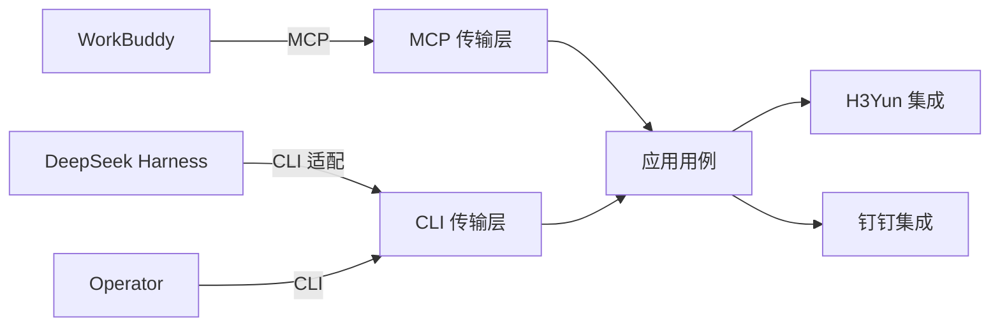

<h1 align="center">CRWU Agent Harness</h1>

<p align="center">
  在同一仓库中统一 AI CLI 工具、MCP 服务器、Python Skills 与 Workflow 编排。
</p>

<p align="center">
  <a href="https://github.com/mmungdong/crwu-ai/releases">
    
  </a>
  <a href="https://go.dev/doc/devel/release">
    
  </a>
  <a href="./Makefile">
    
  </a>
  <a href="./README.md">
    
  </a>
</p>

<p align="center">
  
  
  
  
</p>

---

## 概览

**CRWU Agent Harness** 是一个基于 Go 的命令行工具套件，它通过稳定的命令
目录将各类 AI 宿主与企业系统连接起来。仓库按协议传输层、应用用例、外部系统
集成以及 Python Skills 进行了清晰划分。

> **当前状态：** CLI 命令目录以及首个钉钉员工登录纵向链路已经可以运行。
> 氚云身份映射、氚云业务操作、MCP 工具和 Python Skills 仍待实现。

## 组件

| 组件 | 范围 | 状态 |
|------|------|------|
| **AI CLI** | 人与 AI 驱动的命令入口（`crwu`） |  |
| **认证服务** | 服务端钉钉 OAuth 回调及 CRWU 会话签发（`crwu-server`） |  |
| **MCP Server** | 未来的 Model Context Protocol 传输边界 |  |
| **Python Skills** | 独立打包的 Agent Skills |  |
| **Workflow Engine** | 未来跨提供商流程的编排层 |  |

## 目录

- [概览](#概览)
- [组件](#组件)
- [环境要求](#环境要求)
- [快速开始](#快速开始)
- [钉钉登录](#钉钉登录)
- [命令](#命令)
- [AI 命令发现](#ai-命令发现)
- [架构](#架构)
- [目录结构](#目录结构)
- [开发](#开发)
- [文档](#文档)

## 环境要求

| 依赖 | 版本 | 说明 |
|------|------|------|
| Go | 1.24+ | 构建 `crwu` 必需 |
| GNU Make | 任意 | 用于构建任务 |

## 快速开始

构建两个二进制文件、打印 CLI 版本并运行测试：

```bash
make build
./bin/crwu version
make test
```

如果 Go 不在 `PATH` 中，可以将其路径传给 Make：

```bash
make GO=/path/to/go build
```

生成的二进制文件仅写入 `bin/` 目录。运行 `make clean` 可删除该目录。

## 钉钉登录

`crwu h3yun login` 是第一条完整的身份认证链路。员工只需在钉钉侧授权一次。
服务端校验授权用户属于配置的企业，通过 `unionId` 解析组织内的 `userId`，
签发不透明的 CRWU 会话，并把明确的员工身份返回给 CLI。

钉钉 Client Secret 和钉钉 token 始终保留在 `crwu-server`。CLI 只保存 CRWU
会话；macOS 使用 Keychain，Windows 使用凭据管理器，Linux 使用 Secret
Service。

需要在钉钉企业内部应用中配置完全一致的回调地址：

```text
https://crwu.example.com/oauth/dingtalk/callback
```

应用需要开通“获取当前用户个人信息”和“根据 unionId 获取 userId”对应的钉钉
接口权限。通过服务进程的环境变量注入配置与密钥，然后启动服务：

```bash
export CRWU_PUBLIC_URL=https://crwu.example.com
export CRWU_DINGTALK_CLIENT_ID=your-client-id
export CRWU_DINGTALK_CLIENT_SECRET=your-client-secret
export CRWU_DINGTALK_CORP_ID=your-corp-id
export CRWU_SERVER_ADDR=127.0.0.1:8080
./bin/crwu-server
```

员工可以在 macOS 或 Windows 上运行：

```bash
CRWU_SERVER_URL=https://crwu.example.com ./bin/crwu h3yun login --json
```

无浏览器环境可以增加 `--no-browser`，再由员工在自己的设备上打开命令打印的
地址。远程服务地址强制使用 HTTPS；只有本机开发时允许 HTTP。

第一版会明确返回 `"h3yunIdentity": "not_mapped"`。这表示钉钉身份认证和本机
安全会话保存已经完成，但尚未授权任何氚云操作。下一步必须把这个明确的钉钉
员工精确映射到唯一氚云用户；没有映射时必须拒绝操作。

当前服务端会话仅保存在内存中，`crwu-server` 重启后会失效。它适合本次最小
登录联调，还不适合直接用于生产部署。

## 命令

| 命令 | 用法 | 说明 |
|------|------|------|
| `help` | `crwu help` | 显示可用命令及用法信息 |
| `h3yun login` | `crwu h3yun login [--server <url>] [--no-browser] [--timeout <duration>] [--json]` | 通过钉钉认证当前员工，并把 CRWU 会话保存到操作系统凭据存储中 |
| `h3yun ping` | `crwu h3yun ping` | 用 H3Yun 个人访问凭证对接 H3Yun Agent 网关，验证凭证是否有效 |
| `h3yun tools` | `crwu h3yun tools` | 列出当前员工在 H3Yun Agent 网关可见的工具（含输入 schema） |
| `h3yun session bind` | `crwu h3yun session bind --token <jwt>` | 把当前员工的 H3Yun 网页会话令牌绑定到本机 |
| `h3yun session status` | `crwu h3yun session status` | 查看已绑定的 H3Yun 会话身份与有效期 |
| `h3yun session refresh` | `crwu h3yun session refresh` | 刷新已绑定的 H3Yun 网页会话令牌 |
| `h3yun session clear` | `crwu h3yun session clear` | 清除本机绑定的 H3Yun 网页会话 |
| `h3yun apps list` | `crwu h3yun apps list [--keyword <名称>]` | 通过网页会话列出当前员工可访问的 H3Yun 应用 |
| `h3yun apps children` | `crwu h3yun apps children --app <编码>` | 列出某 H3Yun 应用下的表单功能节点 |
| `h3yun forms search` | `crwu h3yun forms search --keyword <名称>` | 通过网页会话按名称搜索 H3Yun 表单 |
| `h3yun records list` | `crwu h3yun records list --schema <编码> [--page <n>] [--size <n>] [--keyword <kw>]` | 通过网页会话分页列出某表单的业务数据 |
| `h3yun records get` | `crwu h3yun records get --schema <编码> --id <ObjectId>` | 取一条 H3Yun 业务记录详情（含附件字段） |
| `h3yun files list` | `crwu h3yun files list --schema <编码> --id <ObjectId>` | 列出某条记录的全部附件文件 |
| `h3yun file download` | `crwu h3yun file download --schema <编码> --id <ObjectId> --out <目录>` | 把某条记录的所有附件下载到本地目录 |
| `h3yun apps search` | `crwu h3yun apps search --keyword <名称> [--page <n>] [--size <n>]` | 搜索当前员工有权限访问的 H3Yun 应用 |
| `h3yun records query` | `crwu h3yun records query --schema <编码> --sql <只读SELECT>` | 以只读 SQL 查询表单业务数据 |
| `scheme` | `crwu scheme` | 为 AI 客户端输出机器可读的命令目录 |
| `version` | `crwu version` | 显示 CLI 版本及构建提交信息 |

其他 MCP 与提供商专用命令将在首个可用用例中引入。CLI 不会宣传尚未实现的
命令。

## AI 命令发现

`crwu scheme` 是规范的机器可读命令目录。其 JSON 输出包含当前 CLI 版本
以及所有支持的子命令。每个命令都包含英文描述、精确用法以及至少一个带
英文说明的示例。

```bash
crwu scheme
```

该命令仅向标准输出写入 JSON，以便 AI 客户端在不剔除面向人类的日志行的
情况下直接解析。诊断信息写入标准错误，并以非零退出状态返回失败。

在新增或修改命令前，请参阅
[`docs/cli-command-contract.md`](docs/cli-command-contract.md)。

## 架构



设计原则：

- 传输层负责协议模式、命令解析与展示。
- 应用服务协调与宿主无关的用例。
- 集成层负责提供商客户端、认证细节、DTO 以及错误转换。
- H3Yun 与钉钉集成互为兄弟模块，彼此不引用。
- Python Skills 独立打包，不链接到 Go 二进制文件中。

员工认证只有一个身份提供方：钉钉。WorkBuddy 与 DeepSeek Harness 只是外层
调用方，不得改变底层登录协议或应用服务。

## 目录结构

| 路径 | 用途 |
|------|------|
| `cmd/crwu/` | 进程入口 |
| `cmd/crwu-server/` | 钉钉回调与 CRWU 会话服务进程入口 |
| `internal/buildinfo/` | 链接器注入的构建元数据 |
| `internal/transport/cli/` | CLI 命令行为 |
| `internal/transport/mcp/` | 未来的 MCP 协议边界 |
| `internal/transport/httpapi/` | CRWU 认证 HTTP 接口 |
| `internal/app/h3yunlogin/` | 与宿主无关的钉钉登录编排 |
| `internal/app/h3yunops/` | H3Yun 应用服务（凭证来源、网关操作） |
| `internal/app/h3yunweb/` | H3Yun 网页会话应用服务（绑定、刷新、读取） |
| `internal/platform/h3yuncreds/` | H3Yun 会话本地 OS 凭据存储 |
| `internal/integrations/dingtalk/` | 钉钉 OAuth 与员工身份 API 客户端 |
| `internal/integrations/h3yun/` | H3Yun Agent 网关 MCP 客户端 |
| `internal/integrations/crwuserver/` | CLI 侧 CRWU 认证 API 客户端 |
| `internal/auth/` | 用户主体、会话及操作系统凭据存储策略 |
| `internal/config/` | 类型化服务配置加载与校验 |
| `internal/observability/` | 未来的日志、指标与链路追踪 |
| `skills/` | 独立打包的 Python Skills |
| `configs/workbuddy/` | WorkBuddy 配置示例 |
| `deployments/` | 部署资源（待引入） |
| `tests/` | 跨包契约与集成测试 |
| `docs/` | 架构与实现记录 |

## 开发

依次格式化、构建并测试：

```bash
make fmt
make build
make test
```

请保持默认应用版本在 `internal/buildinfo` 与根目录 `Makefile` 中同步。

## 文档

- [`docs/cli-command-contract.md`](docs/cli-command-contract.md) — 每个
  `crwu` 子命令必须遵守的规范。
- [`AGENTS.md`](AGENTS.md) — 面向智能体的开发指南。
- [`CONTEXT.md`](CONTEXT.md) — 项目领域词汇表。
- [`README.md`](README.md) — 同步的英文文档。

---

<p align="center">
  <a href="./README.md">English</a>
</p>
