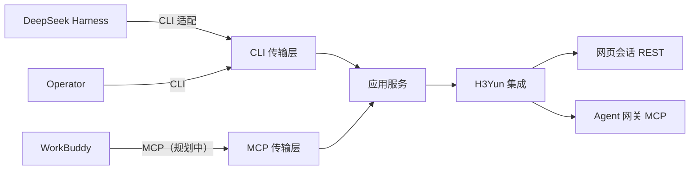

<div align="center">

# 🤖 CRWU Agent Harness

**用一套稳定的命令面把 AI 宿主接入企业系统——始终以正确的员工身份、安全地操作。**

[**English**](README.md)

<br>


*命令行优先 · H3Yun 员工级读取 · 无需运维服务端*

</div>

---

## 🌟 这是什么

CRWU 是一个 **Go 命令行工具集**，为 AI 宿主——WorkBuddy、DeepSeek Harness、
运维终端——提供**稳定、可审计**的企业系统访问方式。一个可执行文件（`crwu`），
一份机器可读的命令目录（`crwu scheme`），智能体可以自行发现命令。

首个生产级垂直能力是 **H3Yun（氚云）员工级数据访问**：

- 🔐 氚云运行在贵司钉钉内，员工**没有氚云独立密码**；
- 📱 员工在 `h3yun.com` 用钉钉扫码，把获得的**网页会话**在本机绑定一次
  （48 小时，可续期）；
- 🛡️ 之后每条命令都**在员工本人权限下执行**——应用、表单、记录与附件，
  与员工在浏览器里看到的一致。无密码、不跨员工串数据、**无需运维任何服务端**。

> ✅ **今天可用：** 会话绑定 · 应用/表单/记录浏览 · 附件下载——全部按员工
> 权限执行。⏳ **路线图：** Agent 网关（`h3pat`）工具、MCP 传输与 Python
> Skills（见 [🔀 双通道](#-双通道两种接入方式)）。

## 🚀 快速开始

```bash
# 前置：Go 1.24+、GNU Make
make build          # 产出 ./bin/crwu
./bin/crwu version
make test
```

产物只写入 `bin/`（`make clean` 可清空）。开始使用**无需配置文件**；可选
环境变量 `H3YUN_BASE_URL` 可在测试时覆盖氚云控制台地址。

## 🔑 员工使用流程

**① 绑定一次会话** —— 让员工在 `h3yun.com` 扫码，然后绑定从浏览器复制的
Bearer JWT（DevTools → Network → `Authorization`）：

```bash
./bin/crwu h3yun session bind --token '<会话 JWT>'
./bin/crwu h3yun session status      # 是谁、哪个引擎、剩余有效期
```

**② 以该员工身份浏览工作台**

```bash
./bin/crwu h3yun apps list
./bin/crwu h3yun apps children --app <应用编码>
./bin/crwu h3yun forms search --keyword <名称>
```

**③ 读取记录并下载附件**

```bash
./bin/crwu h3yun records list    --schema <表单编码> [--keyword <关键词>]
./bin/crwu h3yun records get     --schema <表单编码> --id <记录ID>
./bin/crwu h3yun files list      --schema <表单编码> --id <记录ID>
./bin/crwu h3yun file download   --schema <表单编码> --id <记录ID> --out ./附件
```

> 🔒 **凭证存在哪里？** 只存本机 OS 凭据存储（`internal/platform/h3yuncreds`）
> ——绝不落入文件、日志、scheme 输出或聊天。会话 48 小时后过期，用
> `session refresh` 续期，或重新扫码绑定。

## 🧭 命令参考

### 💻 基础

| 命令 | 作用 |
| --- | --- |
| `crwu help` | 显示可用命令与用法 |
| `crwu scheme` | 为 AI 客户端输出机器可读的命令目录 |
| `crwu version` | 显示 CLI 版本与构建提交 |

### 🔐 会话（员工绑定）

| 命令 | 作用 |
| --- | --- |
| `crwu h3yun session bind --token <jwt>` | 把员工的 H3Yun 网页会话绑定到本机 |
| `crwu h3yun session status` | 查看绑定身份、引擎与有效期 |
| `crwu h3yun session refresh` | 续期已绑定的会话 |
| `crwu h3yun session clear` | 清除已绑定的会话 |

### 📦 应用与表单

| 命令 | 作用 |
| --- | --- |
| `crwu h3yun apps list [--keyword <名称>]` | 列出员工可访问的应用 |
| `crwu h3yun apps children --app <编码>` | 列出某应用下的表单 |
| `crwu h3yun apps search --keyword <名称>` | 搜索应用 *(Agent 通道)* |
| `crwu h3yun forms search --keyword <名称>` | 按名称搜索表单 *(网页会话)* |

### 📋 记录

| 命令 | 作用 |
| --- | --- |
| `crwu h3yun records list --schema <编码> [--page] [--size] [--keyword]` | 分页浏览某表单的记录 |
| `crwu h3yun records get --schema <编码> --id <ID>` | 取单条记录（含各字段） |
| `crwu h3yun records query --schema <编码> --sql <SELECT>` | 只读 SQL 查询 *(Agent 通道)* |

### 📎 附件

| 命令 | 作用 |
| --- | --- |
| `crwu h3yun files list --schema <编码> --id <ID>` | 列出记录的全部附件 |
| `crwu h3yun file download --schema <编码> --id <ID> --out <目录>` | 下载全部附件——原名 + 自动去重 |

### ⚡ Agent 网关（`h3pat`）

| 命令 | 作用 |
| --- | --- |
| `crwu h3yun ping` | 与 H3Yun Agent 网关握手 |
| `crwu h3yun tools` | 列出当前凭证可见的网关工具 |

## 🧠 AI 命令发现

`crwu scheme` 只在标准输出写**纯 JSON**——版本、描述、用法、示例一份目录，
AI 客户端无需剥离人类日志即可解析；诊断走标准错误并以非零码退出。

新增或改动命令前请先阅读
[`docs/cli-command-contract.md`](docs/cli-command-contract.md)。

## 🔀 双通道：两种接入方式

| 通道 | 凭证 | 端点 | 状态 |
| --- | --- | --- | --- |
| 🌐 **会话**（网页控制台） | 员工扫码会话 JWT | `www.h3yun.com/v1/...` | ✅ 可用 |
| ⚡ **Agent**（MCP 网关） | 个人访问凭证 `h3pat_*` | `www.h3yun.com/v1/agent/mcp` | ⏳ 需氚云开通数据面 |

📚 设计记录：[`design-h3yun-auth.md`](docs/design-h3yun-auth.md)（鉴权）·
[`design-h3yun-cli.md`](docs/design-h3yun-cli.md)（CLI）·
[`design-h3yun-connector.md`](docs/design-h3yun-connector.md)（连接器）

## 🏗️ 架构



- 🚏 **传输层**只负责解析与展示（现在是 CLI，将来有 MCP）。
- 🧩 **应用服务**编排与宿主无关的用例（`internal/app/h3yunops`、
  `internal/app/h3yunweb`）。
- 🔌 **集成层**只封装提供商协议——H3Yun 网页 REST 与 Agent MCP 客户端同置
  于 `internal/integrations/h3yun`，互不引用其他提供商。
- 🔑 **凭证**按机器本地绑定（`internal/platform/h3yuncreds`）——**没有需要
  运维的服务端**。

## 📂 目录结构

```text
cmd/crwu/                       进程入口
internal/
  app/h3yunops/                 Agent 网关应用服务
  app/h3yunweb/                 网页会话服务（绑定/续期/读取/附件）
  buildinfo/                    链接器注入的构建元数据
  integrations/h3yun/           H3Yun 网页 REST + Agent MCP 客户端
  platform/h3yuncreds/          H3Yun 会话本地 OS 凭据存储
  transport/cli/                命令行为
  transport/mcp/                未来的 MCP 协议边界
docs/                           设计记录（鉴权 / CLI / 连接器）
tests/                          跨包测试
```

## 🛠️ 开发

```bash
make fmt     # gofmt
make build   # 产出 ./bin/crwu
make test
```

保持默认版本在 `internal/buildinfo` 与根目录 `Makefile` 中同步。

## 📚 文档

- [`docs/cli-command-contract.md`](docs/cli-command-contract.md) — 每个 `crwu` 子命令必须遵守的规范
- [`AGENTS.md`](AGENTS.md) — 面向智能体的开发指南
- [`CONTEXT.md`](CONTEXT.md) — 领域词汇表

---

<div align="center">

**[English](README.md)**

</div>
