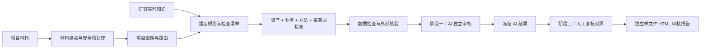
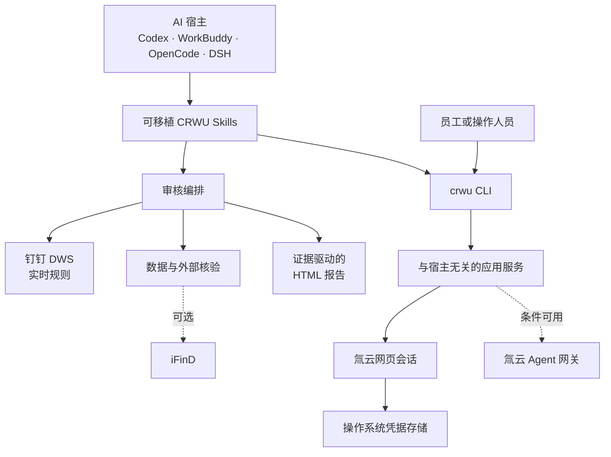

<div align="center">

# CRWU AI 工具箱

**企业级 AI 审核、知识访问与员工权限数据工具——集中在一个代码库中。**

把评估材料、企业知识和业务记录转化为有证据支撑的 AI 工作流，同时确保 AI 的权限不会超过正在使用它的员工。

[English](README.md) · [浏览 Skills](skills/README.md) · [CLI 手册](docs/cli-manual.md) · [变更记录](docs/CHANGELOG.md)

<br>


**CLI 优先 · Skills 原生 · 证据驱动 · 人工复核**

</div>

---

## 为什么选择 CRWU

CRWU 最初是用于安全访问氚云的稳定命令入口，现在已经发展为面向企业工作的实用 AI 工具箱。当前能力包括：

| | 能力 | 可以交付什么 |
| --- | --- | --- |
| 🧭 | **AI 资产评估审核** | 按资产、业务、方法、监管、数据和公共准则等维度路由审核，最终生成一份可追溯的 HTML 报告。 |
| 🔐 | **员工权限企业数据访问** | 员工使用钉钉登录氚云，AI 只能访问该员工本人有权查看的应用、表单、记录和附件。 |
| 📚 | **实时知识依据** | 每次审核从钉钉知识空间解析并下载所需规则正文，不依赖已经过期的复制内容。 |
| 🧩 | **可移植 AI Skills** | 提供可独立安装的 Skills，适配 Codex、WorkBuddy、OpenCode、DeepSeek Harness 及其他兼容的智能体宿主。 |

项目遵循一个简单原则：**AI 的结论不得超出证据、权限和已经验证的计算边界。**

## 能力状态

| 能力领域 | 当前状态 | 说明 |
| --- | --- | --- |
| 资产评估审核编排 | **已可用** | 两阶段独立审核与人工复核对照，交付独立单文件 HTML。 |
| 资产与业务覆盖 | **已可用** | 12 类资产、8 类业务、公共准则、数据检查及可选外部核验。 |
| 氚云网页会话读取 | **已可用** | 员工扫码登录，支持应用、表单、记录、筛选和附件下载。 |
| 钉钉知识库访问 | **配置 DWS 后可用** | 目录元数据可以缓存；规则正文在每次审核时实时下载。 |
| iFinD 外部数据核验 | **条件可用** | 仅当 AI 宿主提供受支持的 iFinD 连接器或 Skill 时启用。 |
| 氚云 Agent 网关 | **条件可用** | 命令已经实现，实际可用性取决于员工凭证及氚云数据面是否开通。 |
| CRWU 独立 MCP 传输 | **架构边界** | 仓库保留 MCP 传输边界，当前正式交付的操作入口仍是 CLI + Skills。 |

## 按你的任务开始

| 我想要…… | 从这里开始 |
| --- | --- |
| 审核一个资产评估项目 | [`crwu-audit`](skills/crwu-audit/SKILL.md) → [审核设计](docs/design-crwu-audit-skills.md) |
| 查看全部 AI Skills | [Skills 目录](skills/README.md) |
| 以员工身份登录氚云 | [`crwu-h3yun-login`](skills/crwu-h3yun-login/SKILL.md) → [CLI 手册](docs/cli-manual.md) |
| 查询表单、记录和附件 | [`crwu-h3yun-query`](skills/crwu-h3yun-query/SKILL.md) |
| 使用钉钉知识库作为审核依据 | [`crwu-dws`](skills/crwu-dws/SKILL.md) → [实时知识协议](docs/design-audit-live-kb-protocol.md) |
| 为 AI 宿主安装或更新 Skills | [`crwu-init`](skills/crwu-init/SKILL.md) |
| 维护或扩展审核体系 | [`AGENTS.md`](AGENTS.md) → [`skills/AGENTS.md`](skills/AGENTS.md) |

## 快速开始

### 1. 构建 CLI

前置条件：**Go 1.24+**、**GNU Make**。

```bash
git clone https://github.com/mmungdong/crwu-ai.git
cd crwu-ai
make build

./bin/darwin/crwu version
make test
```

`make build` 会在 `bin/darwin/` 和 `bin/windows/` 下分别生成 macOS 与 Windows 二进制文件。只需要单一平台时，可使用 `make build-mac` 或 `make build-win`。

### 2. 绑定员工氚云会话

```bash
./bin/darwin/crwu h3yun session login
./bin/darwin/crwu h3yun session status
./bin/darwin/crwu h3yun apps list
```

登录命令会打开浏览器，由员工使用钉钉扫码。生成的会话只存入本机操作系统凭据存储，不会输出到终端或 AI 对话中。

### 3. 安装需要的 Skills

`skills/` 下每个包含 `SKILL.md` 的目录都可以独立安装。推荐从 [`crwu-init`](skills/crwu-init/SKILL.md) 开始，它可以为指定智能体宿主安装全部 Skills、安装指定 Skills，或更新已经安装的 Skills。

从本地仓库为 Codex 引导安装：

```bash
mkdir -p ~/.codex/skills
cp -R skills/crwu-init ~/.codex/skills/crwu-init
```

随后对智能体说：

> 为 Codex 初始化全部 CRWU Skills。

如果使用 WorkBuddy、OpenCode、DeepSeek Harness 或自研宿主，请让 `crwu-init` 在写入前解析并确认目标 Skills 目录。

## AI 资产评估审核

`crwu-audit` 是资产评估审核能力族的总编排层。它先建立项目画像，再加载适用的规则和领域 Skills，严格保留证据边界，交付可复核的结果，而不是一个无法解释的黑盒分数。



### 审核模型

- **先画像、后检查：** 报告形态、交易或业务背景、资产、评估方法和监管覆盖共同决定本次执行集合。
- **多轴并集，而非单一标签：** 资产、业务、方法、覆盖层、公共准则和数据检查等适用能力会合并执行。
- **规则实时获取：** 每个项目都从知识来源获取当前规则正文；Skills 保存路由契约，不复制规则正文。
- **两阶段隔离：** AI 独立审核完成并冻结后，才读取人工复核文件并进行对照。
- **证据优先于自信：** 无法读取、被隐藏、不受支持或未能重算的内容明确标为“未检查”，不得擅自写成“缺失”或“已核验”。
- **最终决定仍由人工作出：** 结果用于辅助专业复核，不替代专业人员判断。

### 报告阅读体验

当前独立 HTML 报告采用任务优先的阅读顺序：

1. AI 审核总结与审核范围；
2. AI 检出的问题项，并在完成对照后明确标出 **AI 独立发现** 及严重程度分布；
3. 外部数据核验；
4. 按顺序列出人工复核文件，并逐条展示 AI 对照结果；
5. 客观的百分比命中率，明确将已修复意见排除在分母之外；
6. 人工确认项、证据与追溯信息。

问题位置和问题描述始终直接展示。较长的修改意见、规则和证据详情放入带清晰提示的展开控件，打印时会自动展开必要内容。即使复核文件标记为“已修复”，如果被审核材料表明问题仍然存在，报告也会单独指出。

## Skills 生态

仓库目前包含 **30 个可以独立安装的 Skills**。

| 分组 | 数量 | 职责 |
| --- | ---: | --- |
| 审核编排 | 1 | 项目画像、路由、两阶段执行与报告交付。 |
| 资产审核 Skills | 12 | 房地产、设备、企业价值、无形资产、矿业权、存货、债权、资产组合、运输设备、含商誉资产组、废旧物资及其他资产。 |
| 业务审核 Skills | 8 | 资产经营、交易处置、财务报告、融资债务、投资资本、税务历史、司法事项及咨询复核。 |
| 数据与外部核验 | 2 | 表格/数据一致性检查及按条件启用的公开数据核验。 |
| 企业数据与知识访问 | 3 | 氚云登录、氚云查询及钉钉 DWS 知识访问。 |
| 准则、分发与维护 | 4 | 公共准则、环境初始化、审核优化及 Skill 维护。 |

Skills 必须满足自洽契约：安装后的 Skill 不能依赖自身目录之外的仓库相对路径。完整触发条件、职责和依赖边界请查看 [Skills 目录](skills/README.md)。

## CLI 与氚云访问

Go CLI 是操作人员和 AI 客户端共用的稳定命令入口。`crwu scheme` 会输出干净的 JSON 命令目录，其中包含描述、用法和示例。

### 员工使用流程

```bash
# 登录并确认当前身份
crwu h3yun session login
crwu h3yun session status

# 查找有权访问的数据
crwu h3yun apps list
crwu h3yun apps children --app <appCode>
crwu h3yun forms search --keyword <name>

# 读取记录并下载附件
crwu h3yun records list --schema <schemaCode> --filter "Status = 1"
crwu h3yun records get --schema <schemaCode> --id <recordId>
crwu h3yun file download --schema <schemaCode> --id <recordId> --out ./files
```

<details>
<summary><strong>展开完整 CLI 命令目录</strong></summary>

#### 基础命令

| 命令 | 作用 |
| --- | --- |
| `crwu scheme [command-path]` | 为 AI 客户端输出机器可读的命令目录。 |
| `crwu version` | 显示 CLI 版本、提交、构建时间和运行平台。 |

#### 氚云会话

| 命令 | 作用 |
| --- | --- |
| `crwu h3yun session login` | 打开浏览器，用钉钉扫码并把员工会话绑定到本机。 |
| `crwu h3yun session bind --token <jwt>` | 作为回退方式，绑定受信任的员工网页会话令牌。 |
| `crwu h3yun session status` | 查看绑定身份、引擎和有效期。 |
| `crwu h3yun session refresh` | 续期已经绑定的会话。 |
| `crwu h3yun session clear` | 从本机移除已经绑定的会话。 |

#### 应用、表单与记录

| 命令 | 作用 |
| --- | --- |
| `crwu h3yun apps list [--keyword <name>]` | 列出员工有权访问的应用。 |
| `crwu h3yun apps children --app <code>` | 列出某个应用内的表单节点。 |
| `crwu h3yun apps search --keyword <name>` | 通过 Agent 通道搜索应用。 |
| `crwu h3yun forms search --keyword <name>` | 通过员工网页会话搜索表单。 |
| `crwu h3yun records list --schema <code> [--keyword <kw>] [--filter <expr>]` | 分页读取记录，支持关键词与字段条件。 |
| `crwu h3yun records get --schema <code> --id <id>` | 读取一条记录及其字段。 |
| `crwu h3yun records query --schema <code> --sql <select>` | 通过 Agent 通道执行只读 SELECT。 |

#### 附件与 Agent 网关

| 命令 | 作用 |
| --- | --- |
| `crwu h3yun files list --schema <code> --id <id>` | 列出某条记录的附件。 |
| `crwu h3yun file download --schema <code> --id <id> --out <dir>` | 下载某条记录的全部附件。 |
| `crwu h3yun file get --id <fileId> --out <file>` | 按文件 ID 下载单个附件。 |
| `crwu h3yun ping` | 与氚云 Agent 网关握手。 |
| `crwu h3yun tools` | 列出当前凭证可见的网关工具。 |

</details>

完整参数、输出契约、筛选条件和示例请查看 [CLI 手册](docs/cli-manual.md)。修改命令时必须遵循 [CLI 命令契约](docs/cli-command-contract.md)，并以 `crwu scheme` 为权威目录。

## 架构



- **Skills** 描述工作流、路由、证据规则和宿主侧工具使用方式。
- **CLI 传输层**负责参数解析与展示，应用服务不依赖具体 AI 宿主。
- **提供商集成层**分别封装氚云协议，彼此不交叉引用。
- **审核知识**按库内路径和规则编号解析，并为当前项目实时下载。
- **交付物**是自包含文件，离开执行环境后仍能正常阅读。

## 安全与可信边界

| 边界 | 项目规则 |
| --- | --- |
| 员工身份 | 每份氚云凭证必须属于一名明确员工，系统不得回退到管理员或引擎级身份。 |
| 凭证处理 | 氚云会话只存入操作系统凭据存储，不进入仓库文件、日志、`scheme` 输出或聊天。 |
| 权限校验 | 员工凭证通过验证后，才允许执行员工权限范围内的操作。 |
| 数据写入 | 氚云查询工作流和钉钉知识访问按只读方式设计。 |
| 表格隐藏区域 | 默认审核模式跳过人工隐藏的工作表、行和列；读取更深层内容必须显式改变边界。 |
| 不受支持的证据 | “未检查”不得改写为“缺失”，未完成重算的数值不得表述为“已核验”。 |
| 外部数据源 | 只通过明确支持的数据源进行外部核验；连接器不可用时必须如实报告。 |

> [!IMPORTANT]
> CRWU 帮助复核人员发现、整理和比较证据。专业结论与最终审批仍由具备相应资格的人工复核人员负责。

## 仓库结构

```text
crwu-ai/
├── cmd/crwu/                     # CLI 进程入口
├── internal/
│   ├── app/                      # 与 AI 宿主无关的应用服务
│   ├── integrations/h3yun/       # 氚云网页与 Agent 网关客户端
│   ├── platform/                 # 凭据存储与扫码登录
│   └── transport/                # CLI 与 MCP 协议边界
├── skills/                       # 30 个自包含 AI Skills
│   ├── crwu-audit/               # 审核路由、契约、脚本和模板
│   ├── crwu-audit-asset-*/       # 12 类资产审核能力
│   ├── crwu-audit-biz-*/         # 8 类业务审核能力
│   ├── crwu-dws/                 # 钉钉知识实时访问
│   └── crwu-h3yun-*/             # 员工登录与查询工作流
├── docs/                         # 手册、契约、设计与变更记录
├── scripts/html/                 # 独立 HTML 工具/示例
└── tests/                        # 跨包验证
```

## 开发

```bash
make fmt
make test
make build

# 校验所有 Skill 及其自洽性契约
python3 skills/crwu-dev-audit-skill-maintainer/scripts/kb_tool.py \
  validate --skill-root skills
```

参与开发时：

1. CLI 核心行为与 AI 宿主适配层保持分离；
2. 每个可执行命令都必须登记到 `crwu scheme`；
3. 每个 Skill 都必须能够独立安装；
4. CLI 功能变更需要同步更新 `docs/cli-manual.md` 和 `docs/CHANGELOG.md`；
5. 本文档必须与 [`README.md`](README.md) 保持同步。

CLI 默认版本必须在 `internal/buildinfo` 与根目录 `Makefile` 中保持一致。

## 文档导航

| 文档 | 适合查看什么 |
| --- | --- |
| [CLI 手册](docs/cli-manual.md) | 命令、参数、环境变量、筛选条件和操作流程。 |
| [Skills 目录](skills/README.md) | 完整 Skill 清单、审核轴、触发条件与职责。 |
| [审核 Skills 设计](docs/design-crwu-audit-skills.md) | 领域模型、能力树与路由架构。 |
| [实时知识协议](docs/design-audit-live-kb-protocol.md) | 审核如何解析并获取当前知识，同时避免复制规则正文。 |
| [DWS 设计](docs/design-crwu-dws.md) | 钉钉目录缓存与正文实时获取模型。 |
| [CLI 命令契约](docs/cli-command-contract.md) | 命令描述、用法、示例和机器发现要求。 |
| [变更记录](docs/CHANGELOG.md) | 最近的功能、审核系统与交付模板变更。 |
| [智能体开发指南](AGENTS.md) | 仓库级开发约束与安全规则。 |
| [领域上下文](CONTEXT.md) | 共享术语与系统边界。 |

---

<div align="center">

**即使证据不完整，也让 AI 工作流保持可信——因为它会准确说明自己检查了什么。**

[English](README.md) · [Skills](skills/README.md) · [CLI 手册](docs/cli-manual.md)

</div>
