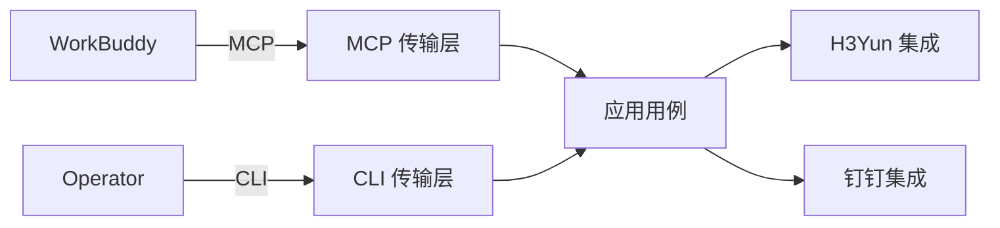

<h1 align="center">CRWU Agent Harness</h1>

<p align="center">
  在同一仓库中统一 AI CLI 工具、MCP 服务器、Python Skills 与 Workflow 编排。
</p>

<p align="center">
  <a href="https://github.com/mmungdong/crwu-ai/releases">
    
  </a>
  <a href="https://go.dev/doc/devel/release">
    
  </a>
  <a href="./Makefile">
    
  </a>
  <a href="./README.md">
    
  </a>
</p>

<p align="center">
  
  
  
  
</p>

---

## 概览

**CRWU Agent Harness** 是一个基于 Go 的命令行工具套件，它通过稳定的命令
目录将 WorkBuddy 与企业系统连接起来。仓库按协议传输层、应用用例、外部系统
集成以及 Python Skills 进行了清晰划分。

> **当前状态：** 可执行的项目骨架。MCP 工具、H3Yun/钉钉 API、认证以及
> Python Skills 均已规划，将在首个可用用例中逐步引入。

## 组件

| 组件 | 范围 | 状态 |
|------|------|------|
| **AI CLI** | 人与 AI 驱动的命令入口（`crwu`） |  |
| **MCP Server** | 未来的 Model Context Protocol 传输边界 |  |
| **Python Skills** | 独立打包的 Agent Skills |  |
| **Workflow Engine** | 未来跨提供商流程的编排层 |  |

## 目录

- [概览](#概览)
- [组件](#组件)
- [环境要求](#环境要求)
- [快速开始](#快速开始)
- [命令](#命令)
- [AI 命令发现](#ai-命令发现)
- [架构](#架构)
- [目录结构](#目录结构)
- [开发](#开发)
- [文档](#文档)

## 环境要求

| 依赖 | 版本 | 说明 |
|------|------|------|
| Go | 1.24+ | 构建 `crwu` 必需 |
| GNU Make | 任意 | 用于构建任务 |

## 快速开始

构建二进制文件、打印版本并运行测试：

```bash
make build
./bin/crwu version
make test
```

如果 Go 不在 `PATH` 中，可以将其路径传给 Make：

```bash
make GO=/path/to/go build
```

生成的二进制文件仅写入 `bin/` 目录。运行 `make clean` 可删除该目录。

## 命令

| 命令 | 用法 | 说明 |
|------|------|------|
| `help` | `crwu help` | 显示可用命令及用法信息 |
| `scheme` | `crwu scheme` | 为 AI 客户端输出机器可读的命令目录 |
| `version` | `crwu version` | 显示 CLI 版本及构建提交信息 |

MCP 与各类提供商专用命令将在首个可用用例中引入。当前骨架不会宣传尚未
实现的命令。

## AI 命令发现

`crwu scheme` 是规范的机器可读命令目录。其 JSON 输出包含当前 CLI 版本
以及所有支持的子命令。每个命令都包含英文描述、精确用法以及至少一个带
英文说明的示例。

```bash
crwu scheme
```

该命令仅向标准输出写入 JSON，以便 AI 客户端在不剔除面向人类的日志行的
情况下直接解析。诊断信息写入标准错误，并以非零退出状态返回失败。

在新增或修改命令前，请参阅
[`docs/cli-command-contract.md`](docs/cli-command-contract.md)。

## 架构



设计原则：

- 传输层负责协议模式、命令解析与展示。
- 应用服务协调与宿主无关的用例。
- 集成层负责提供商客户端、认证细节、DTO 以及错误转换。
- H3Yun 与钉钉集成互为兄弟模块，彼此不引用。
- Python Skills 独立打包，不链接到 Go 二进制文件中。

目前仅支持并记录 WorkBuddy 作为 AI 宿主。协议代码避免与 WorkBuddy 私有
实现耦合，但不声明或维护对其他宿主的兼容性。

## 目录结构

| 路径 | 用途 |
|------|------|
| `cmd/crwu/` | 进程入口 |
| `internal/buildinfo/` | 链接器注入的构建元数据 |
| `internal/transport/cli/` | CLI 命令行为 |
| `internal/transport/mcp/` | 未来的 MCP 协议边界 |
| `internal/app/` | 未来共享的应用用例 |
| `internal/integrations/` | 未来的 H3Yun 与钉钉适配器 |
| `internal/auth/` | 未来横切身份策略 |
| `internal/config/` | 未来类型化配置加载 |
| `internal/observability/` | 未来的日志、指标与链路追踪 |
| `skills/` | 独立打包的 Python Skills |
| `configs/workbuddy/` | WorkBuddy 配置示例 |
| `deployments/` | 部署资源（待引入） |
| `tests/` | 跨包契约与集成测试 |
| `docs/` | 架构与实现记录 |

## 开发

依次格式化、构建并测试：

```bash
make fmt
make build
make test
```

请保持默认应用版本在 `internal/buildinfo` 与根目录 `Makefile` 中同步。

## 文档

- [`docs/cli-command-contract.md`](docs/cli-command-contract.md) — 每个
  `crwu` 子命令必须遵守的规范。
- [`AGENTS.md`](AGENTS.md) — 面向智能体的开发指南。
- [`CONTEXT.md`](CONTEXT.md) — 项目领域词汇表。
- [`README.md`](README.md) — 同步的英文文档。

---

<p align="center">
  <a href="./README.md">English</a>
</p>
