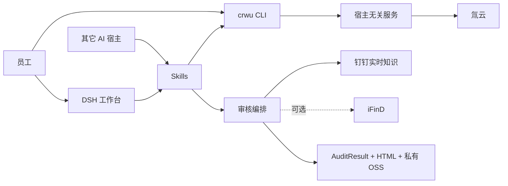

<div align="center">

# CRWU AI

**面向资产评估工作的企业级 AI 审核工具**

CRWU 将员工权限数据、实时专业知识、证据边界清晰的审核流程和可追溯交付连接起来。

[English](README.md) · [工作台](plugins/dsh-crwu-workbench/README.md) · [Skills](docs/skills.md) · [CLI 手册](docs/v0.0.1/cli-manual.md) · [变更记录](docs/v0.0.1/CHANGELOG.md)


**员工权限 · 实时知识 · 证据驱动 · 人工复核**

</div>

## 仓库包含什么

| 组成 | 职责 | 入口 |
| --- | --- | --- |
| 中瑞世联工作台 | DeepSeek Harness 环境配置、报告审核、审核记录、交付件与分析会话 | [`plugins/dsh-crwu-workbench/`](plugins/dsh-crwu-workbench/) |
| 资产评估审核 Skills | 项目画像、多轴路由、专业检查、证据边界与交付编排 | [`docs/skills.md`](docs/skills.md) |
| `crwu` CLI | 以员工身份访问氚云应用、表单、记录和附件，并提供机器可读命令发现 | [`docs/v0.0.1/cli-manual.md`](docs/v0.0.1/cli-manual.md) |

CRWU 用于辅助专业复核；最终判断仍由具备相应资格的复核人员和审批人员负责。

## 从任务开始

| 目标 | 使用入口 |
| --- | --- |
| 安装或操作 DSH 工作台 | [工作台指南](plugins/dsh-crwu-workbench/README.md) |
| 审核资产评估报告 | [`crwu-audit`](plugins/dsh-crwu-workbench/skills/crwu/crwu-audit/SKILL.md) |
| 理解或维护 Skill 分层 | [Skills 指南](docs/skills.md) |
| 登录氚云或查询员工可见数据 | [CLI 手册](docs/v0.0.1/cli-manual.md) |
| 使用钉钉实时知识 | [`crwu-dws`](plugins/common/skills/crwu-dws/SKILL.md) |
| 为其它 AI 宿主安装 Skills | [AI 宿主目录说明](docs/agent-skill-dirs.md) |
| 修改仓库或插件行为 | 先读 [`AGENTS.md`](AGENTS.md)，再读最近的子目录 `AGENTS.md` |

## 快速开始

### 构建 CLI

需要 Go 与 GNU Make。

```bash
git clone https://github.com/mmungdong/crwu-ai.git
cd crwu-ai
make build
make test
./bin/darwin/crwu version
```

只构建一个平台时使用 `make build-mac` 或 `make build-win`。通过 `crwu scheme` 发现当前安装版本的命令契约。

### 登录氚云

```bash
crwu h3yun session login
crwu h3yun session status
```

员工在浏览器中完成钉钉扫码。CRWU 验证员工会话后写入操作系统凭据存储，不打印令牌，也不索取氚云密码。

### 安装工作台

安装 npm 已发布版本：

```bash
dsh plugin --profile web add dsh-crwu-workbench@latest
```

维护者可以构建并检查本地接收方产物：

```bash
make plugin-pack
dsh plugin --profile web add ./dist/dsh-crwu-workbench-<version>.tgz
```

插件通过 npm 分发。OSS 只用于私有审核交付，不承担插件分发。

### 为其它宿主安装 Skills

按需选择 Skill 目录，并使用宿主支持的 Skill 安装流程。Skill 目录及其 `SKILL.md` 元数据是库存事实源；
目录位置见 [AI 宿主目录说明](docs/agent-skill-dirs.md)，所有权、同步和校验规则见 [Skills 指南](docs/skills.md)。

## 核心边界

- **员工身份：** 每次氚云操作都使用明确绑定的员工凭据，不回退到管理员或引擎级身份。
- **实时证据：** 审核 Skill 保存路由与装配契约；适用知识正文在本次审核中现场获取。
- **两阶段复核：** AI 独立意见冻结后，才能读取人工复核意见。
- **可见数据：** 隐藏或不支持的材料写成“未检查”，不能推断为“缺失”或“已核验”。
- **结构化执行：** 工作台只暴露窄范围 Tool，不向模型开放任意业务命令或沙箱控制。
- **私有交付：** 审核产物按配置进入私有 OSS，并在需要时使用限时访问。
- **宿主独立：** 应用服务不依赖 WorkBuddy、DeepSeek Harness 或其它 AI 宿主。

## 架构


```mermaid
flowchart LR
    Employee[员工] --> Workbench[DSH 工作台]
    Employee --> CLI[crwu CLI]
    Hosts[其它 AI 宿主] --> Skills
    Workbench --> Skills
    Skills --> Audit[审核编排]
    Skills --> CLI
    CLI --> Services[宿主无关服务]
    Services --> H3Yun[氚云]
    Audit --> DWS[钉钉实时知识]
    Audit -. 可选 .-> iFinD
    Audit --> Delivery[AuditResult + HTML + 私有 OSS]
```

Host 侧负责文件、Shell、凭据和外部服务；Client 侧负责浏览器状态与交互；共享模块只保存线协议与环境无关逻辑。

## 开发与验证

```bash
make docs-check   # 现行 Markdown 链接与防漂移规则
make test         # Go 测试
make plugin-check # 工作台、Skill、构建和包形状完整门禁
git diff --check
```

仓库规则按作用域分布在 [`AGENTS.md`](AGENTS.md)、[`plugins/AGENTS.md`](plugins/AGENTS.md) 和工作台 [`AGENTS.md`](plugins/dsh-crwu-workbench/AGENTS.md)。

### 工作台版本与 npm 发布

```bash
make plugin-version
make plugin-version-set PLUGIN_RELEASE_VERSION=<version>
make plugin-npm-login
make plugin-npm-whoami
make plugin-publish-dry-run
```

日常发布使用 `plugin-v*` tag 工作流。明确授权的应急手动发布还必须提供：

```bash
make plugin-publish CONFIRM_PUBLISH=dsh-crwu-workbench@<version>
```

该目标要求 Git 工作树干净、npm 已登录、本地版本高于 npm 最新版本，并在上传前通过完整 dry-run。

## 文档

| 文档 | 用途 |
| --- | --- |
| [工作台指南](plugins/dsh-crwu-workbench/README.md) | 安装、配置与员工操作流程 |
| [Skills 指南](docs/skills.md) | 分层、所有权、安装与维护 |
| [CLI 手册](docs/v0.0.1/cli-manual.md) | 人工与 Agent 操作流程 |
| [CLI 命令契约](docs/v0.0.1/cli-command-contract.md) | `crwu scheme` 元数据与兼容要求 |
| [审核系统设计](docs/v0.0.1/design-crwu-audit-skills.md) | 项目画像、路由、证据与交付模型 |
| [实时知识协议](docs/v0.0.1/design-audit-live-kb-protocol.md) | 本次审核知识获取契约 |
| [变更记录](docs/v0.0.1/CHANGELOG.md) | CLI 与审核系统功能历史 |
| [领域上下文](CONTEXT.md) | 共享术语与系统边界 |
