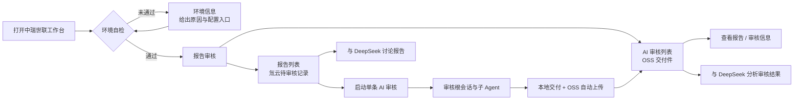
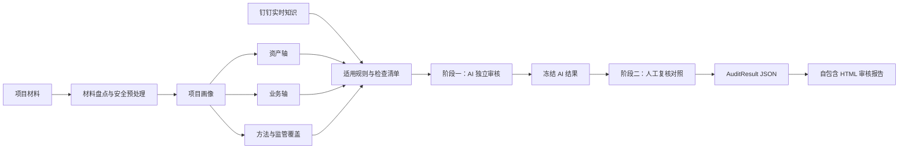
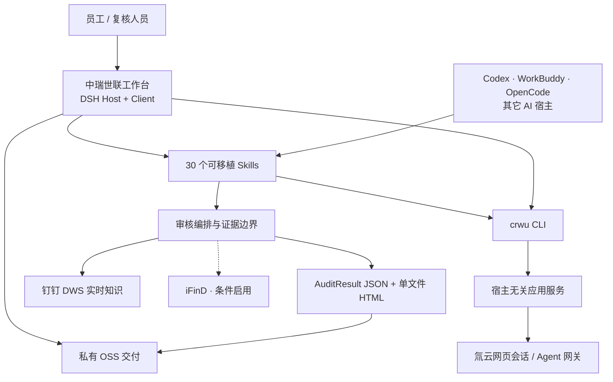

<div align="center">

# CRWU AI

**面向资产评估工作的企业级 AI 审核平台**

从员工权限数据、实时专业知识到两阶段审核与可追溯交付，CRWU 把完整工作流连接到一个可信边界内。

[English](README.md) · [Skills 目录](docs/skills.md) · [CLI 手册](docs/v0.0.1/cli-manual.md) · [插件指南](plugins/dsh-crwu-workbench/README.md) · [变更记录](docs/v0.0.1/CHANGELOG.md)

<br>


**员工权限 · 实时知识 · 证据驱动 · 人工复核**

</div>

---

## 一眼看懂 CRWU

CRWU 不是一个只会给出结论的聊天机器人。它由三部分组成：

| 产品层 | 作用 | 当前交付形态 |
| --- | --- | --- |
| **中瑞世联工作台** | 在 DeepSeek Harness 中完成环境自检、报告审核、审核追踪、结果查看与分析会话 | DSH 包插件 `dsh-crwu-workbench` |
| **资产评估审核 Skills** | 对项目画像、多轴路由、专业检查、两阶段隔离和报告交付进行编排 | 30 个可独立安装的 AI Skills |
| **CRWU CLI** | 以员工身份安全访问氚云应用、表单、记录和附件，并向 AI 暴露稳定命令目录 | Go 二进制 `crwu` |

核心原则只有一句：

> **AI 的判断不得超出它实际取得的证据、员工权限和已经验证的计算边界。**

## 当前能力

| 能力 | 状态 | 说明 |
| --- | --- | --- |
| DSH 中瑞世联工作台 | **可用** | 三模块侧栏、环境硬门禁、报告审核、审核记录、OSS 交付件与 DeepSeek 分析会话。 |
| 两阶段资产评估审核 | **可用** | 阶段一 AI 独立审核并冻结，阶段二再读取人工复核意见做对照。 |
| 资产与业务专业覆盖 | **可用** | 12 类资产、8 类业务、公共准则、数据检查和条件式外部核验。 |
| 氚云员工会话读取 | **可用** | 钉钉扫码登录，支持应用、表单、记录、筛选和附件读取。 |
| 钉钉实时知识 | **配置 DWS 后可用** | 缓存目录元数据；每次审核重新获取本次适用的规则正文。 |
| 阿里云 OSS 审核交付 | **配置后可用** | 私有 Bucket、员工侧凭据、自动上传和限时签名链接。 |
| iFinD 外部数据核验 | **条件可用** | 仅在宿主提供受支持的 iFinD 连接器或 Skill 时启用。 |
| 报告评估模块 | **开发中** | 工作台入口已保留，当前正式可用模块是“报告审核”。 |
| 独立 MCP 服务 | **预留边界** | 代码保留 transport 边界；当前正式入口仍是工作台、CLI 与 Skills。 |

## 从你的任务开始

| 我想做什么 | 推荐入口 |
| --- | --- |
| 在 DSH 中安装完整工作台 | [工作台安装与使用](plugins/dsh-crwu-workbench/README.md) |
| 审核一份资产评估报告 | [`crwu-audit`](plugins/dsh-crwu-workbench/skills/crwu-audit/SKILL.md) |
| 查看全部审核能力 | [Skills 目录](docs/skills.md) |
| 登录氚云并查询业务数据 | [`crwu-h3yun-login`](plugins/common/skills/crwu-h3yun-login/SKILL.md) → [CLI 手册](docs/v0.0.1/cli-manual.md) |
| 使用钉钉知识库中的实时规则 | [`crwu-dws`](plugins/common/skills/crwu-dws/SKILL.md) |
| 为 Codex 等宿主安装 Skills | [AI 宿主目录说明](docs/agent-skill-dirs.md) |
| 扩展或维护审核体系 | [`AGENTS.md`](AGENTS.md) → [`plugins/AGENTS.md`](plugins/AGENTS.md) |

## 中瑞世联工作台

工作台以一张常驻的侧栏分组卡进入。它跟随 DSH 主题，展开时展示三个固定模块，收起时保留品牌入口。

| 模块 | 当前体验 |
| --- | --- |
| **报告评估** | 正式规划中的模块；当前展示克制的开发中页面，并引导进入报告审核。 |
| **报告审核** | 待审核报告、AI 审核记录、启动/停止/重审、交付件查看、审核信息 Drawer 与 DeepSeek 会话。 |
| **环境信息** | 检查工具、登录认证、上传配置和外部数据四层前置条件；未通过时阻止发起审核。 |

### 工作台流程


```mermaid
flowchart LR
    A[打开中瑞世联工作台] --> B{环境自检}
    B -->|未通过| C[环境信息<br/>给出原因与配置入口]
    C --> B
    B -->|通过| D[报告审核]
    D --> E[报告列表<br/>氚云待审核记录]
    D --> F[AI 审核列表<br/>OSS 交付件]
    E --> G[启动单条 AI 审核]
    G --> H[审核根会话与子 Agent]
    H --> I[本地交付 + OSS 自动上传]
    I --> F
    E --> J[与 DeepSeek 讨论报告]
    F --> K[查看报告 / 审核信息]
    F --> L[与 DeepSeek 分析审核结果]
```

### 报告审核体验

- **一个统一工作面：** 报告列表与 AI 审核列表共享搜索、刷新、加载、分页和业务时间口径。
- **单条审核并发：** 同一时间只运行一条审核；支持停止、重启、状态恢复和上传失败重试，避免多个 Agent 对写同一案例。
- **结果优先的信息层级：** 审核信息 Drawer 先显示复核命中率、AI 检出问题和“已提未改”，技术字段默认折叠。
- **交付件按业务语义展示：** 用户看到“审核报告”“审核数据”，而不是 OSS 原始路径和内部对象名。
- **版本感知的分析会话：** 创建审核分析会话前，先比较报告、审核产物和复核意见的远端版本证据；可能过期时明确让用户选择。
- **开发与安装形态可识别：** 侧栏和面板共享 `dev` / 版本标签，Host 与 Client 协议不一致时停止发起审核并提示重启。

### 远端资料边界

“讨论报告”和“分析审核结果”两类业务会话只接收本次从远端业务系统取得的资料标识与上下文：

- 报告资料来自氚云附件，审核交付件来自 OSS；
- 上下文记录远端 `fileId`、对象 key、ETag、更新时间、digest 与获取时间；
- 不把本地案例路径作为报告身份，也不在远端读取失败时偷偷回退到本地旧副本；
- 远端资料不足时不创建会话，只说明缺失事实并允许重试。

## 快速开始

### 1. 构建 CRWU CLI

前置条件：**Go 1.24+** 与 **GNU Make**。

```bash
git clone https://github.com/mmungdong/crwu-ai.git
cd crwu-ai

make build
./bin/darwin/crwu version
make test
```

`make build` 默认生成：

```text
bin/darwin/crwu
bin/windows/crwu.exe
```

只构建当前需要的平台时，可使用 `make build-mac` 或 `make build-win`。

### 2. 登录氚云

以下示例假设 `crwu` 已加入 `PATH`；否则请替换为刚刚构建的二进制路径。

```bash
crwu h3yun session login
crwu h3yun session status
crwu h3yun apps list
```

登录命令打开独立浏览器窗口，由员工使用钉钉扫码。会话令牌在进程内取得后写入操作系统凭据存储，不输出到终端或 AI 对话。

### 3. 安装 DSH 工作台

插件开发需要 **Node.js `^22.19.0` 或 `>=24.0.0`**。

```bash
make plugin-pack
dsh plugin --profile web add ./dist/dsh-crwu-workbench-<版本>.tgz
```

插件包同时包含：

- Host 与 Client 两个构建入口；
- 插件部署 YAML；
- 27 个插件专属的审核与维护 Skills；
- 3 个公共 Skills。

维护者可以使用 `make plugin-dist` 校验并分发插件。远端已有同版本、但内容不同的 tarball 时，命令会拒绝覆盖，必须先升级版本号。

### 4. 给其它 AI 宿主安装 Skills

```bash
make skills-install AGENT_DIR=~/.codex/skills
```

目录布局就是 Skill 名单，不维护第二份清单文件：

- `plugins/common/skills/`：公共的氚云与钉钉能力；
- `plugins/dsh-crwu-workbench/skills/`：审核能力族与维护能力；
- `plugins/dsh-crwu-workbench/common/skills/`：打包时生成的公共 Skill 同步副本，不是源文件入口。

支持宿主的目录约定见 [AI 宿主目录说明](docs/agent-skill-dirs.md)。

## 资产评估审核模型

`crwu-audit` 是审核能力族的总编排层。它不把项目压成一个粗糙分类，而是建立多轴项目画像，再合并执行适用能力。


```mermaid
flowchart LR
    A[项目材料] --> B[材料盘点与安全预处理]
    B --> C[项目画像]
    C --> D[资产轴]
    C --> E[业务轴]
    C --> F[方法与监管覆盖]
    K[钉钉实时知识] --> G[适用规则与检查清单]
    D --> G
    E --> G
    F --> G
    G --> H[阶段一：AI 独立审核]
    H --> I[冻结 AI 结果]
    I --> J[阶段二：人工复核对照]
    J --> L[AuditResult JSON]
    L --> M[自包含 HTML 审核报告]
```

审核过程遵守以下约束：

- **多轴并集：** 资产、业务、方法、监管覆盖、公共准则、数据检查与外部核验共同决定执行集合。
- **知识实时获取：** Skill 保存路由与装配契约，不复制易过期的规则正文。
- **两阶段隔离：** AI 独立意见冻结前不得读取人工复核文件。
- **可见区边界：** 默认跳过人工隐藏的工作表、行、列和隐藏区媒体；“未检查”不得写成“缺失”。
- **结构化事实源：** 先生成并校验 AuditResult JSON，再由同一事实源生成员工 HTML 与监控结果。
- **人工最终负责：** CRWU 辅助发现、整理和比较证据，不替代具备资格的专业判断与最终审批。

## Skills 生态

仓库包含 **30 个可独立安装的 Skills**：

| 分组 | 数量 | 职责 |
| --- | ---: | --- |
| 审核总路由 | 1 | 项目画像、多轴装配、两阶段流程和交付编排。 |
| 资产审核 | 12 | 房地产、设备、企业价值、无形资产、矿业权、存货、债权、资产组合、运输设备、含商誉资产组、废旧物资与其他资产。 |
| 业务审核 | 8 | 资产经营、交易处置、财务报告、融资债务、投资资本、税务历史、司法清算补偿与咨询复核。 |
| 数据与外部核验 | 2 | 表格/数据勾稽与按条件启用的 iFinD 外部核验。 |
| 公共规则与输出 | 2 | 通用准则与审核意见屏蔽规则。 |
| 企业访问 | 3 | 氚云登录、氚云查询和钉钉 DWS 知识访问。 |
| 维护能力 | 2 | 审核差距分析与审核 Skill 维护。 |

每个 Skill 必须能在脱离源仓后独立安装和运行，不得依赖自身目录之外的仓库路径。完整清单见 [Skills 目录](docs/skills.md)。

## CRWU CLI

Go CLI 是操作人员与 AI 客户端共用的稳定命令面。`crwu scheme` 输出机器可读 JSON，命令描述、用法和示例与真实 Cobra 命令树同步。

```bash
# 发现命令
crwu scheme
crwu scheme h3yun records

# 登录并确认员工身份
crwu h3yun session login
crwu h3yun session status

# 查找员工有权访问的数据
crwu h3yun apps list
crwu h3yun apps children --app <appCode>
crwu h3yun forms search --keyword <name>

# 读取记录和附件
crwu h3yun records list --schema <schemaCode> --filter "Status = 1"
crwu h3yun records get --schema <schemaCode> --id <recordId>
crwu h3yun files list --schema <schemaCode> --id <recordId>
crwu h3yun file get --id <fileId> --out ./files/report.pdf
```

参数、筛选语法、输出形状与 Agent 网关命令见 [CLI 手册](docs/v0.0.1/cli-manual.md)。

## 系统架构


```mermaid
flowchart TB
    USER[员工 / 复核人员]
    DSH[中瑞世联工作台<br/>DSH Host + Client]
    HOSTS[Codex · WorkBuddy · OpenCode<br/>其它 AI 宿主]
    SKILLS[30 个可移植 Skills]
    AUDIT[审核编排与证据边界]
    CLI[crwu CLI]
    APP[宿主无关应用服务]
    H3[氚云网页会话 / Agent 网关]
    DWS[钉钉 DWS 实时知识]
    OSS[私有 OSS 交付]
    IFIND[iFinD · 条件启用]
    REPORT[AuditResult JSON + 单文件 HTML]

    USER --> DSH
    DSH --> SKILLS
    HOSTS --> SKILLS
    SKILLS --> AUDIT
    SKILLS --> CLI
    DSH --> CLI
    DSH --> OSS
    AUDIT --> DWS
    AUDIT -.-> IFIND
    AUDIT --> REPORT
    CLI --> APP
    APP --> H3
    REPORT --> OSS
```

边界设计：

- **Skills** 描述业务工作流、路由、证据规则和工具使用方式；
- **应用服务**不依赖具体 AI 宿主，CLI 只是传输层；
- **氚云网页会话与 Agent 网关**是彼此独立的 provider integration；
- **DSH 插件 Host**负责文件、Shell、OSS、子 Agent 和凭据相关操作；
- **DSH 插件 Client**只负责浏览器状态与交互，通过同源 RPC 与 Host 通信。

## 安全与可信边界

| 边界 | 项目规则 |
| --- | --- |
| 员工身份 | 每份氚云凭据属于一名明确员工，不回退到管理员或引擎级身份。 |
| 凭据存储 | 氚云会话进入操作系统凭据存储；OSS 凭据保存在员工机器并收紧文件权限；密钥不进入仓库。 |
| 最小权限 | 查询在员工本人的可见范围内执行；读取本机凭据的 DSH 命令必须先取得员工授权。 |
| 数据来源 | 业务分析会话只使用本轮明确取得的远端资料，不用来源不明的本地副本补齐结论。 |
| 两阶段隔离 | 阶段一冻结前不读取人工复核意见，避免把人工结论伪装成 AI 独立发现。 |
| 隐藏数据 | 人工隐藏区默认禁读禁报；需要改变边界时必须显式说明。 |
| 结论强度 | 无法读取、无法重算或不受支持时写“未检查”，不能写成“缺失”或“已核验”。 |
| 私有交付 | 审核产物进入私有 Bucket，访问链接默认使用限时签名 URL。 |

> [!IMPORTANT]
> CRWU 是专业复核辅助系统。它不会替代具备相应资格的评估人员、复核人员或审批人员作出最终决定。

## 仓库结构

```text
crwu-ai/
├── cmd/
│   ├── crwu/                         # 正式 CLI 入口
│   └── probe/                        # 协议探测工具
├── internal/
│   ├── app/                          # 宿主无关的应用服务
│   ├── integrations/h3yun/           # 氚云 Web 与 Agent 网关客户端
│   ├── platform/                     # 扫码登录、浏览器发现、系统凭据存储
│   └── transport/cli/                # Cobra CLI 与 scheme 命令目录
├── plugins/
│   ├── common/skills/                # 3 个公共 Skills（源文件）
│   └── dsh-crwu-workbench/
│       ├── src/host/                 # Host 操作、配置、状态与领域服务
│       ├── src/client/               # 侧栏、工作台界面与浏览器状态
│       ├── src/shared/               # Host / Client 共享协议
│       ├── skills/                   # 27 个审核与维护 Skills
│       ├── config/                   # 唯一部署 YAML
│       ├── tests/                    # Node 单元与集成测试
│       └── scripts/                  # 构建、打包与发布校验
├── scripts/                          # 仓库级插件分发工具
├── docs/                             # 手册、设计、计划与变更记录
├── .github/workflows/                # Go / 插件 CI 与 npm 发布
└── Makefile                          # CLI、插件和 Skills 的统一入口
```

## 开发与验证

### Go CLI

```bash
make fmt
make test
make build
```

### DSH 插件完整门禁

```bash
make plugin-check
```

这条命令覆盖：

1. 插件版本与 YAML 配置一致性；
2. 公共 Skills 同步检查；
3. TypeScript 严格类型检查；
4. Node 单元/集成测试；
5. Host 与 Client 双端构建；
6. 构建产物真实加载冒烟；
7. npm tarball 文件清单和安装形状；
8. 两个 Skill 根的自洽性 lint；
9. 审核路由、维护工具、DWS 数据契约与分发守卫测试。

如只在插件目录开发：

```bash
cd plugins/dsh-crwu-workbench
npm ci
npm run check
npm run pack:assert
```

开发约束以 [`AGENTS.md`](AGENTS.md)、[`plugins/AGENTS.md`](plugins/AGENTS.md) 和插件自己的 [`AGENTS.md`](plugins/dsh-crwu-workbench/AGENTS.md) 为准。

## 版本与分发

CLI 与工作台独立发版：

| 交付物 | 当前源码版本 | 分发方式 |
| --- | --- | --- |
| `crwu` CLI | `0.0.1` | `make build` 生成 macOS / Windows 二进制 |
| `dsh-crwu-workbench` | `0.0.4` | npm、TGZ 或 OSS 静态分发 |
| AI Skills | 随源仓演进 | 随插件包交付，或由 `make skills-install` 安装 |

插件版本必须在 `package.json`、`VERSION` 和插件 `CHANGELOG.md` 三处一致。`plugin-v*` tag 驱动 npm 发布；OSS 分发坚持“同一个版本号只发布一次”。

## 文档导航

| 文档 | 内容 |
| --- | --- |
| [工作台插件指南](plugins/dsh-crwu-workbench/README.md) | 安装、配置、开发循环、真机验收和发布。 |
| [Skills 目录](docs/skills.md) | 30 个 Skills 的职责、触发条件与依赖边界。 |
| [CLI 手册](docs/v0.0.1/cli-manual.md) | 命令、参数、筛选语法、环境变量与操作流程。 |
| [审核系统设计](docs/v0.0.1/design-crwu-audit-skills.md) | 项目画像、能力树、多轴路由和交付模型。 |
| [实时知识协议](docs/v0.0.1/design-audit-live-kb-protocol.md) | 每次审核如何定位并获取当前知识正文。 |
| [CLI 命令契约](docs/v0.0.1/cli-command-contract.md) | `crwu scheme`、命令描述、用法和示例要求。 |
| [插件 UI 设计规范](plugins/dsh-crwu-workbench/docs/ui-design-guidelines.md) | 视觉语言、主题变量、布局与交互规则。 |
| [插件开发笔记](plugins/dsh-crwu-workbench/docs/development-notes.md) | Cordis 生命周期、Host/Client 边界、构建与历史踩坑。 |
| [变更记录](docs/v0.0.1/CHANGELOG.md) | CLI、Skills 和审核系统的历史变更。 |
| [领域上下文](CONTEXT.md) | 共享术语与系统边界。 |

---

<div align="center">

**让 AI 说清楚它检查了什么、依据什么，以及什么仍然需要人来判断。**

[返回顶部](#crwu-ai) · [English](README.md) · [开始使用](#快速开始)

</div>
