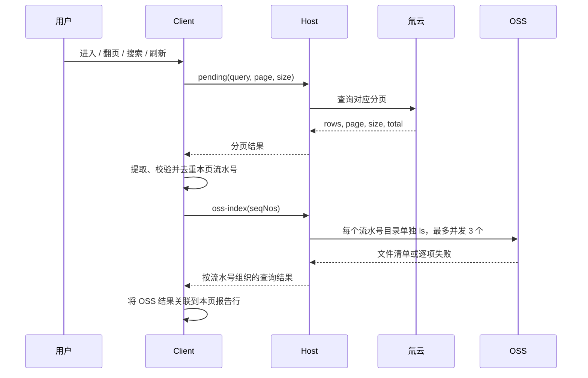

# 报告审核单列表与分页 OSS 查询设计

> 文档性质：2026-10-09 的已评审设计快照；实现已按本方案落地。它不是当前操作指南。
> 当前实现以源码、测试和项目 AGENTS.md 为准，当前入口见 [插件 README](../../../plugins/dsh-crwu-workbench/README.md)。

## 1. 需求与成功标准

用户已确定以下方向：

1. 「报告审核」只保留「报告列表」，删除「AI审核列表」及顶部切换 Tab。
2. 刷新只查询当前分页，再按本页报告流水号读取对应 OSS 审核文件清单。
3. 当前页流水号一次提交给插件 Host，由 Host 分别查询对应 OSS 目录，最多同时执行 3 个查询。
4. 原 AI 审核列表的查看报告、查看审核信息、结果分析及交付件操作融合到报告行。

完成标准：用户在同一张表内完成报告查找、发起审核、查看结果和结果分析；列表刷新不扫描审核总前缀，不下载本页所有审核 JSON，不重做环境自检。

本轮交付设计文档；业务实现、版本调整、安装和发布属于后续工作。

## 2. 现状与技术依据

现有 [WorkbenchPanel.tsx](../../../plugins/dsh-crwu-workbench/src/client/features/workbench/WorkbenchPanel.tsx) 分别维护氚云分页、OSS 全量索引及云端搜索状态。进入报告审核页时调用 `pending`、`audit-status` 和无参 `oss-index`；报告列表刷新只调用 `pending`。`ReportPane` 本地维护 `pending/results` 两个视图。

现有 [oss/ops.ts](../../../plugins/dsh-crwu-workbench/src/host/oss/ops.ts) 已支持 `oss-index({ seqNo })`：使用 `ossutil ls` 长格式列举 `<配置前缀>/<流水号>/`，返回文件名、大小、更新时间和 ETag。`oss-result` 按精确对象 key 读取 JSON，并返回裁剪后的审核摘要；`oss-link` 负责打开云端对象。

插件打包的 ossutil 为 1.7.19，版本由 [sync-binaries.mjs](../../../plugins/dsh-crwu-workbench/scripts/sync-binaries.mjs) 定义。OSS 普通 `ListObjectsV2` 只有一个前缀参数；ossutil 的多个 `--include` 条件不能代替多个目录的服务端精确查询。上游 1.x 实现先列举对象，再过滤输出。

参考：[ListObjectsV2](https://help.aliyun.com/zh/oss/developer-reference/listobjectsv2/)、[ossutil 1.x 列举源码](https://github.com/aliyun/ossutil/blob/master/lib/ls.go)、[ossutil 过滤说明](https://help.aliyun.com/zh/oss/developer-reference/advanced-commands/)。

因此，本设计的批量是一次 Client → Host 请求；Host → OSS 仍是每个流水号一次目录查询，目录过大时可能有后续 OSS 分页请求。

## 3. 选定方案与范围

选定「氚云分页为主、OSS 定向补齐」：



比较过的其他方式：从总前缀列举再过滤会重新引入全量扫描；OSS 数据索引需要额外开通、费用和索引维护，不用于本次分页刷新。

### 3.1 列表权威来源

- 行集合、排序、页码、每页条数和总数都来自氚云分页结果。
- OSS 仅补充本页报告的审核文件与查询状态，不增加行、不改变排序、不改变总数。
- 搜索沿用现有氚云流水号精确/包含匹配规则，提交后回第 1 页；输入过程中不发请求。
- 仅存在于 OSS、没有出现在氚云查询结果中的记录，不再有独立列表入口。
- 有效关联键是 `task.seqNo`。流水号缺失或格式不合法的行保留展示，标记「流水号不可查询」，不把报告名当作 OSS 路径。
- 多条业务记录拥有相同流水号时，只查询一次 OSS，查询结论关联到各业务行；界面行身份使用业务记录 id，审核身份继续遵循 Host 既有规则。

### 3.2 文件布局

读取当前标准布局 `<配置前缀>/<流水号>/`，正式交付件仍只识别：

- `审核意见.<流水号>.html`
- `审核结果.<流水号>.json`

其他文件保留在交付件清单内，但不能当作正式审核结果。旧年月布局没有当前目录副本时不会被本次查询找到；如需纳入，实施前应另行核实存量并定向迁移，页面不得通过扫描总前缀兜底。

## 4. 页面与操作设计

页面保留「报告审核」标题。「报告列表」为普通文字标题，不是按钮，不保留单项 Tab。总数只在分页区显示一次。搜索与刷新共用一条工具栏，下方直接展示报告表格。

表格列为：报告名称、报告流水号、风险等级、人工复核、AI审核、更新时间、操作。人工复核继续展示氚云原始字段；AI审核展示本地运行状态与远端查询事实，不将二者合成一个不可解释的状态。

```text
报告审核
报告列表
[按报告流水号搜索                         ] [刷新]
报告名称 | 流水号 | 风险 | 人工复核 | AI审核 | 更新时间 | 操作
……
共 N 条 · 第 P / Q 页                         分页控件
```

### 4.1 AI审核列

远端状态文案：查询中、未找到审核结果、审核报告与数据齐全、仅有审核报告、仅有审核数据、仅有辅助文件、查询失败、流水号不可查询。

本地审核中、正在停止、已停止、审核中断和回传失败等状态，继续来自 `AuditView` 与 Host 停止状态机。远端旧结果存在且本地正在重新审核时，同时表达「审核中」与「已有云端结果」，不能把旧结果当作本次审核已完成。

保留每行一个主按钮、小鲸鱼和必要时的「•••」菜单，使用既有主题、Tooltip、菜单和抽屉样式。

### 4.2 功能迁移

| 功能 | 单列表入口与可用条件 |
| --- | --- |
| 查看报告 | 有正式 HTML 时为主按钮，打开该行的精确对象 key。 |
| 发起 AI 审核 | 远端查询成功且无正式交付件、无本地审核历史时提供；遵循现有环境及占用门禁。 |
| 重新审核 | 本地有审核历史或远端存在正式 HTML/JSON 时提供，保留覆盖前确认；有 HTML 时放入菜单。 |
| 停止审核 | 保留现有菜单动作及 Host 停止状态机，确认静默前不得启动替代审核。 |
| 查看审核信息 | 有正式 JSON 时放入菜单，按需读取并打开既有抽屉；JSON 单独存在时也允许查看。 |
| 分析审核结果 | 存在正式 HTML 或 JSON 时，小鲸鱼进入既有 `audit_analysis` 流程。 |
| 讨论原始报告 | 无正式交付件时为小鲸鱼动作；有交付件时保留在菜单，继续使用既有报告讨论流程。 |
| 原始交付件 | 有正式交付件时放入菜单，沿用优先打开 JSON、否则打开 HTML 的行为。 |
| 复制流水号 | 保留流水号单元格复制，也将原结果列表的菜单入口合并。 |
| 打开本地 HTML | 有 Host 已登记的本地文件时保留菜单动作。 |
| 重传 OSS | 沿用本地记录的可重传条件，成功后只定向更新该流水号。 |
| 重试结果查询 | 当前行远端查询失败时提供，只重试该流水号，不重取氚云分页。 |

远端查询中或失败时，不能据 `cloud === undefined` 推断「从未审核」。本轮设计选择暂时禁用发起/重新审核，直到获得远端明确结论；报告讨论和本地状态查看仍按已有权限提供。停止审核不受 OSS 查询失败影响。

只存在 JSON 也属于已有审核结果，必须走重新审核确认，不能显示无需确认的首次审核按钮。只有辅助文件且没有正式 HTML/JSON，不构成已有审核结果。

### 4.3 分析与讨论行为

复用现有报告资料登记、会话查找/恢复、审核摘要读取、版本比较、过期确认和 Limited Context 流程。移动入口时保留这些判断，不新建第二套会话逻辑。

查询中的新行暂时禁用小鲸鱼，避免点击后在报告讨论与结果分析之间切换。查询失败的行使用明确的「讨论报告」入口；不可用已过期的远端清单默认为最新结果分析。

分析准备中的遮罩移动到统一列表数据区。页面标题、搜索与工具栏保持可见。Tooltip 与无障碍标签跟随实际动作分别显示「讨论报告」或「分析审核结果」。

## 5. 批量接口契约

### 5.1 操作名与参数

扩展既有 `oss-index` 操作，不新增业务 CLI 命令。批量参数为 `{ seqNos: string[] }`；既有 `{ seqNo: string }` 继续用于单报告场景。

请求形状：

```json
{
  "op": "oss-index",
  "args": {
    "seqNos": [
      "2026-301705-LX10170-BG8746",
      "2026-301705-LX10171-BG8747"
    ]
  }
}
```

Host 校验规则：

1. 使用参数是否存在区分批量和既有模式，禁止将空数组或非法值转换成无参全量查询。
2. `seqNos` 必须是数组，原始条数上限 100，与氚云分页上限一致；超限直接失败，不静默截断。
3. 每项必须是字符串，经 trim 后通过共享 `isSafeSeqNo`：长度不超过 128，符合现有流水号形状，不含 `/` 或 `..`。
4. 任一项非法时整批拒绝，校验在任何凭据/配置读取、命令及网络请求之前完成。Client 先将不可查询的业务行排除并标记，正常提交只包含合法流水号。
5. 同时提交 `seqNo` 和 `seqNos` 时返回参数错误；合法数组保序去重。
6. `seqNos: []` 返回成功空结果，不执行命令。新版列表不会调用无参模式，且不得将批量失败回退到无参模式。

### 5.2 应答

共享类型定义放在 `src/shared/`，Host 返回类型和 Client 门面引用同一声明，加入线协议赋值检查。批量应答为：

```ts
interface OssBatchIndexResult {
  ok: boolean
  error: string
  results: Record<string, OssBatchItemResult>
}

type OssBatchItemResult =
  | { ok: true; error: ''; item: CloudItem | null }
  | {
      ok: false
      error: string
      errorKind: 'access' | 'config' | 'command' | 'truncated' | 'invalid-result' | 'timeout' | 'cancelled'
      item: null
    }
```

- `ok: false` 表示参数、公共环境或授权等导致整批无法执行，`error` 为脱敏说明，`results` 为空。
- `ok: true` 表示请求被有效执行，每个去重流水号都有一个结果；部分或全部条目失败也返回 `ok: true`，Client 必须逐项判断。
- 单项目录列举成功且没有对象：`item: null`。有辅助文件但没有正式交付件：`item` 保留 `files`，`htmlKey/jsonKey` 为空。
- 截断、无法可信解析、命令失败或未完成查询均为逐项失败，不能回 `item: null` 冒充不存在。
- `item.seqNo` 必须等于结果映射键；返回对象 key 必须位于该流水号的精确目录前缀内。越界或错配条目按 `invalid-result` 失败处理。
- 不返回 bucket、endpoint、配置路径、原始命令或签名链接。审核对象的相对 key 保留在 `CloudItem`，供既有详情和打开操作使用；普通表格只显示业务语义。

单流水号模式保留既有应答形状；Client 用明确的批量方法调用，避免组件自行判断应答属于哪一种模式。

## 6. Host 执行与生命周期

新增聚焦的 `src/host/oss/batch.ts` 负责输入校验、批量调度和逐项结果；现有 OSS 模块提供可复用的单目录查询执行函数。公共前置检查与包内二进制解析每批一次，每条命令仍经过既有 Broker。

- 查询命令使用当前标准目录和 `ls` 长格式，不传 `--short-format`，保留 ETag、更新时间与大小。
- 来源为 `panel`，命名操作为 `oss.remote.read`；每次实际执行都经授权判定，不因批量前置检查成功就跳过后续 Broker。
- 并发上限 3，限制范围为插件 Host 实例的批量目录查询队列，防止多个页面请求各启动 3 个而叠加。详情读取、签名和上传保留各自执行路径。
- 整批截止时间 90 秒，从批量请求受理开始计时，排队时间包含在内；单命令 timeout 不超过该批剩余时间。到期中止运行命令，未执行或未完成条目标记 `timeout`，保留已完成结果。
- 不额外套整批自动重试；沿用执行器现有行为并受截止时间约束。用户通过整页刷新或单行重试发起新的查询。
- 初版不引入持久化或跨页 OSS 缓存；每次显式刷新真实查询。公共配置和二进制解析复用既有机制。
- 批量队列和中止控制器归插件生命周期管理；dispose 时取消运行任务并清理待执行任务。

### 6.1 请求取消

Client 为每轮分页与 OSS 补齐持有 AbortController。翻页、重新搜索、模块离开或组件卸载时取消旧轮请求；独立的审核状态轮询使用自己的生命周期。

现有 `rpc` 没有取消选项，Host 的 `Operation` 也没有请求上下文。实施时作小范围扩展：`rpc` 接受可选 signal，`Operation` 接受可选的内部请求上下文 `{ signal?: AbortSignal }`，HTTP route 根据请求中断或响应完成前连接关闭触发取消。既有 handler 可以忽略第二参数，批量 handler 将 signal 传给队列与 `runOssutil`。

请求正常完成不能误触发中止；监听器在结束时清理。取消不修改审核任务、占用锁或上传状态。断线后无法发送应答时，Host 仍必须释放任务资源。

Client 同时保留轮次校验；即使底层取消未及时生效，旧轮次结果也不能写入当前页面。

## 7. Client 状态与刷新规则

### 7.1 一轮查询

`loadReportPage({ query, page, size })` 是首次进入、翻页、搜索和刷新的统一入口：

1. 递增请求轮次，取消旧请求，记录目标查询条件；关闭旧行菜单、Tooltip 及依赖旧页的弹层。
2. 请求 `pending`，检查轮次与 `ok` 后采用 Host 返回的实际分页上下文。
3. 展示新页业务行，逐行远端状态为 `loading` 或 `invalid`。不得混入上一页的 OSS 结果。
4. 提取合法、去重流水号；为空时结束，不发批量 RPC。
5. 调用一次批量 `oss-index`，检查轮次后将结论按流水号合并，完成本轮。

状态至少区分：业务分页加载、远端结果加载、分页读取失败、整批 OSS 失败、逐行 OSS 成功/失败。不要用一个布尔值同时代表「报告读失败」与「云端没结果」。

Client 的远端逐行状态为 `loading | ready | failed | invalid`；`ready` 中的 `item: null` 才代表查询确认无对象。UI 的交付件状态由正式 HTML/JSON 是否存在派生。

### 7.2 刷新、翻页与失败

| 触发或结果 | 行为 |
| --- | --- |
| 首次进入审核模块 | 加载当前查询上下文及本页 OSS；审核状态独立获取并开始既有轮询。 |
| 从其他模块返回 | 保留搜索词、页码和页大小，按该上下文重新加载，不回第 1 页。 |
| 刷新 | 保留当前已提交搜索条件、页码及页大小；报告分页成功后再补齐本页 OSS。 |
| 翻页或页大小改变 | 查询目标分页；页大小改变时回第 1 页，再查该页流水号。 |
| 搜索提交或清空 | 更新已提交查询条件并回第 1 页；仅输入不发请求。 |
| 氚云查询失败 | 不发送 OSS 请求；已有行保留并标记为旧数据，报告列表错误明确可见。目标页不可伪装成已加载。 |
| 当前页变为空 | 展示当前空页，停止 OSS 查询；超出最新总页数时提示并提供跳到最后有效页的动作，不静默额外请求。 |
| OSS 部分失败 | 业务列表可用，失败只标在对应行，可单行重试。 |
| OSS 整批失败 | 保留业务列表，所有合法流水号行置为查询失败，展示一条公共错误，不重复堆满错误文案。 |
| 同页刷新中 | 保留旧行，工具栏显示加载；旧云端结论标记为正在更新，禁用发起/重新审核。 |

刷新按钮在本轮进行中禁用，避免重复刷新。OSS 仍在加载时允许翻页或提交新搜索，新轮取消旧轮。总数与分页始终来自当前已成功提交的业务分页快照。

同页刷新失败时，可继续查看明确标注为旧数据的既有报告，但不能依据旧云端状态启动或重新启动审核。首次读取还没有本地审核状态时，沿用既有等待门禁，不先显示错误的首次审核按钮。

### 7.3 审核结束和上传后的局部更新

列表刷新不附带 `audit-status`；运行状态继续走现有 10 秒轮询，轮询本身不反复查询本页 OSS。

- 手动重传成功：查询该流水号目录，不重取氚云分页。
- 自动上传完成：以 `AuditView.uploadedAt` 从空到有值或时间变化为触发事实，若该流水号仍在当前页，查询一次该目录；失败后不在每轮状态轮询自动重试。
- 当前页之外的审核完成：不为该报告补发页面 OSS 查询，用户翻到对应页时正常加载。
- 逐行重试和上传后查询都使用单项批量请求 `seqNos: [seqNo]`，返回后验证页轮次与行请求轮次。
- 同行新查询开始后，旧查询结果不能覆盖新结论；页批量与上传后局部查询竞争时，以该行最近发起的查询为准。
- 检测到上传时该行仍在页批量查询中，取消该行旧结论的写入资格，待当前查询结束后补一次新查询，保证上传完成后的结果优先。

## 8. 兼容、文档和改动边界

复用 `pending`、`oss-index`、`oss-result`、`oss-link`、`report-files`、`audit-start/stop/status`、报告讨论及结果分析流程。界面删除 `results` 视图、独立云端搜索状态、全量云端加载入口和对应 Tab 样式。

主要源码改动位置：

| 边界 | 文件及责任 |
| --- | --- |
| Client 编排 | `WorkbenchPanel.tsx`：统一分页加载、批量补齐、取消、局部更新和轮次控制。 |
| Client 界面 | `ReportPane.tsx`、`row.ts`：删除双视图，迁移操作，加入远端未知/失败门禁；现有分析和讨论模块复用。 |
| Client RPC | `features/report-audit/api.ts`、`api/client.ts`：批量方法、共享返回类型及可选 signal。 |
| Host OSS | `oss/batch.ts`、`oss/ops.ts`：有界批量调度、共享单目录读取、结构化失败。 |
| Host 请求上下文 | `ops/types.ts`、`ops/core.ts`、`http/route.ts`：可选请求 signal 与批量分支。 |
| Shared | `types.ts`、`wire-contract.ts`、`consts.ts`：共享批量契约及协议递增。 |
| 展示与验收 | `locales/zh-CN.ts`、既有样式和 `install/browser-check.mjs`：文案、列宽和单列表浏览器断言。 |

Host/Client 契约与行为发生变化，实施时将 `WORKBENCH_PROTOCOL` 在当时源码值基础上加 1，并验证旧 Host 被明确拦截。保持已存在的单流水号接口与操作注册清单一致，不新增 model-visible Tool，也不改变审核 Skill。

实施时更新插件 README、CHANGELOG、`docs/ui-design-guidelines.md` 中双 Tab、结果列表和「翻页不查询 OSS」的旧口径；历史设计正文保留。发布版本由仓库工具同步，不能覆盖其他工作已做的版本调整。本次未改变 CLI 命令或输出契约，无需新增 CLI catalog 项。

## 9. 验证与验收

实现前先加入能因既有行为而失败的测试；测试不访问真实氚云、OSS、凭据或员工文件。

### 9.1 Host

- 批量输入缺失、非数组、非字符串、混合参数、超限、越界和非法流水号：拒绝且零 I/O。
- 空数组：成功空结果且零命令；重复项只查一次。
- 每个命令只查询其流水号目录；多个批次共享队列，并发峰值不超过 3。
- 一条目录查询同时带回 HTML/JSON 元数据，保持正式文件名识别与精确目录隔离。
- 无对象、仅辅助文件、HTML 单独存在、JSON 单独存在、两者齐全：分别返回可信结论。
- 一项失败不丢其他成功项；截断、错配和无法解析不能判为不存在。
- 截止时间包含排队，取消和 dispose 均停止后续派发并向执行器传播 signal。
- 逐条 Broker 校验、脱敏错误与单流水号接口兼容。

### 9.2 Client

- 页面没有 AI审核列表入口或切换 Tab；功能全部在报告行。
- 请求顺序为当前 `pending` 成功后一次本页批量 `oss-index`；空页或 `pending` 失败不查 OSS。
- 搜索、翻页、刷新保留正确上下文；刷新不发 env、report-files、oss-result 或无参 oss-index。
- 快速翻页、局部重试与上传完成查询竞争时，旧响应不能覆盖新页或新行。
- 查询中、查询失败与无结果有不同状态；未知状态不显示可直接启动的首次审核动作。
- JSON 单独存在视为已有结果，查看信息可用且重新审核需要确认。
- 小鲸鱼按结果存在情况路由；原始报告讨论可从有结果行菜单进入。
- 分析的过期、资料不足、恢复会话、版本快照和远端资料范围判断继续生效。
- 自动上传事实变化只触发一次当前页对应行的 OSS 查询，普通状态轮询不扫描 OSS。
- 原有停止、重传、会话与本地文件操作规则继续通过测试。

### 9.3 浏览器与仓库门禁

浏览器验收覆盖浅/深主题、宽/窄视口、七列表格的横向滚动、菜单位置、键盘焦点、Loading/空态/失败态，以及列表总数与分页同源。查询中不显示「未找到」，刷新时已有内容不清空闪烁。

实施后运行窄测试，再运行 `make plugin-check`、`make docs-check` 和 `git diff --check`。依赖真实 Host 的接受测试由用户重启 profile 后执行；设计文档检查不能代替实现或真机验收。

## 10. 设计决策记录

- 一次提交当前页流水号、Host 并发 3 个目录查询：已由用户确认。
- 单列表、取消顶部 Tab、迁移原 AI 审核列表功能：来自用户需求。
- 单列表以氚云分页为权威、JSON 单独存在也算审核历史、远端未知时禁用启动、批量 90 秒截止及取消：本设计提出的具体规则，随本文件一并评审。
- 本文件不授权提交、推送、安装、发布或直接开始业务实现。
